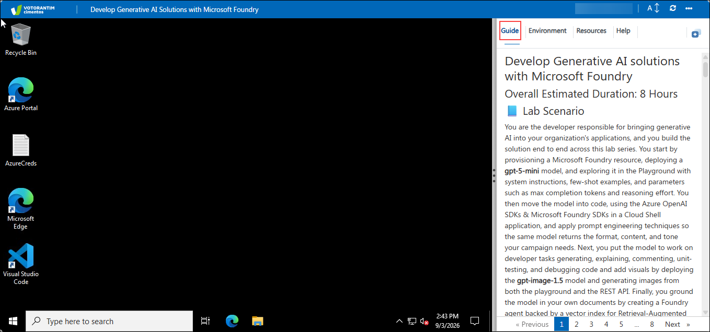
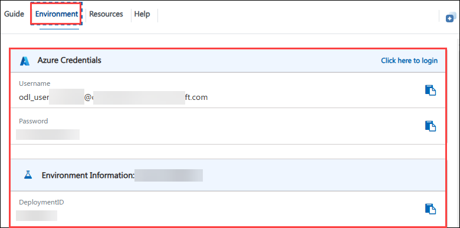
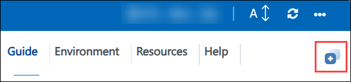
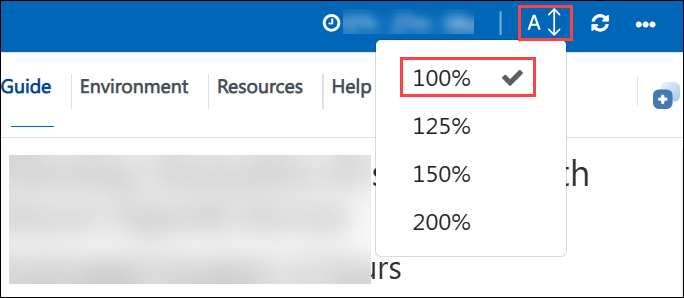
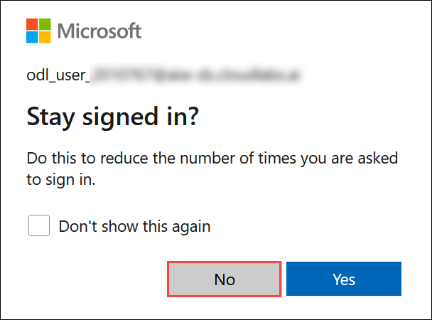
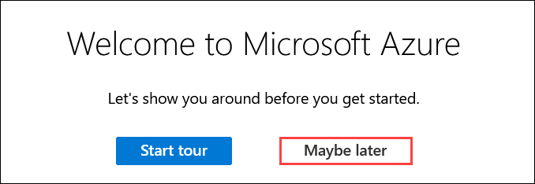

# Develop Generative AI Solutions with Microsoft Foundry 

## Overall Estimated Duration: 8 Hours

## 📘 Lab Scenario

You are the developer responsible for bringing generative AI into your organization's applications, and you build the solution end to end across this lab series. You start by provisioning a Microsoft Foundry resource, deploying a **gpt-5-mini** model, and exploring it in the Playground with system instructions, few-shot examples, and parameters such as max completion tokens and reasoning effort. You then move the model into code, using the Azure OpenAI SDKs & Microsoft Foundry SDKs in a Cloud Shell application, and apply prompt engineering techniques so the same model returns the format, content, and tone your campaign needs. Next, you put the model to work on developer tasks generating, explaining, commenting, unit-testing, and debugging code and add visuals by deploying the **gpt-image-1.5** model and generating images from both the playground and the REST API. Finally, you ground the model in your own documents by creating a Foundry agent backed by a vector index for Retrieval-Augmented Generation, and close the series with a responsible AI review of the default content filters and guardrail controls that keep the deployment safe.

## 📖 Lab Overview

This hands-on lab offers a comprehensive introduction to the Microsoft Foundry. You will begin by configuring the service and integrating Azure OpenAI SDKs and Foundry SDKs into your application. Techniques in prompt engineering will refine interactions, and you'll also gain skills in generating and enhancing code. The gpt-image-1.5 model will be utilized for image generation, and you will explore the use of your own data for retrieval-augmented generation (RAG). Additionally, you will delve into content filtering to manage and regulate generated outputs. Throughout the labs, you'll gain practical experience with real-world AI applications, learn best practices for deploying and scaling these services in a production environment, and understand how to integrate various Azure services to develop resilient, scalable, and secure AI-powered applications.

## 🎯 Lab Objective 

This lab is aimed at giving learners hands-on experience with Microsoft Foundry resources, deploying and exploring models using the Completions and Chat playgrounds, and experimenting with prompts, parameters, and code generation. By completing this lab

Participants will learn:

- **Get started with the Microsoft Foundry:** This hands-on exercise aims to teach you the fundamentals of using Microsoft Foundry to integrate advanced AI models into your apps. Participants will set up and begin utilizing the Azure OpenAI  SDKs to integrate AI models into their applications.

- **Use Azure OpenAI SDKs in your app:** This hands-on exercise demonstrates how to integrate Azure OpenAI SDKs into your application to improve AI capabilities. Participants will integrate and use Azure OpenAI SDKs within their application.

- **Utilize prompt engineering in your app:** This hands-on exercise demonstrates how to use prompt engineering methods to improve AI interactions in your application. Participants will use prompt engineering strategies to enhance the performance and relevance of AI.

- **Generate and improve code with :** The goal of this hands-on exercise is to demonstrate how to effectively generate and refine code using Microsoft Foundry model. Participants will improve their abilities to create and refine code with Microsoft Foundry tools and approaches.

- **Generate images with a gpt-image-1.5 model:** The goal of this hands-on activity is to produce and alter images using the gpt-image-1.5 model. To attain the intended visual results, participants will develop and alter images using the gpt-image-1.5 model.

- **Add your data for RAG using Microsoft Foundry Service:** This hands-on exercise will help you integrate your data with the Microsoft Foundry for Retrieval-Augmented Generation (RAG) to improve AI responses. Participants will integrate data into the Microsoft Foundry to boost AI-powered retrieval and generation.

- **Explore content filters in Microsoft Foundry:** This hands-on exercise demonstrates how to construct and maintain content filters in Microsoft Foundry portal to control and refine generated outputs. Participants will learn about and implement content filters in Microsoft Foundry Guardrails to control and refine the created material.

## ⚙️ Prerequisites

Participants should have:

- Ensure you have the **Foundry User role** to interact with agents and generative models (such as text and image generation).
- **Development Skills:** Basic programming knowledge and experience with APIs and SDKs.
- **AI Concepts:** Understanding prompt engineering, code development, and image generation using models such as gpt-image-1.5.
- **Content Management:** Understanding data integration for RAG and content filtering techniques.
   
## 🏗️ Architecture

This lab provides robust functionalities for leveraging AI within Azure. Microsoft Foundry integrates your data with large language models, enabling customized and secure interactions tailored to your needs. Microsoft Foundry Models offer pre-trained and customizable models for various applications, such as text generation and language translation. Azure CloudShell provides an online, browser-based shell for managing Azure resources and running scripts, streamlining cloud management. gpt-image-1.5 generates images from textual descriptions using advanced AI technology, enhancing creative capabilities. Finally, prompt engineering refines input prompts to optimize AI model responses, ensuring accuracy and relevance in outputs.

## 🖼️ Architecture Diagram

## 🔍 Explanation of Components

The architecture for this lab involves the following key components:

- **Microsoft Foundry:** The unified Azure platform for building, deploying, and managing generative AI solutions. It brings models, data, agents, and responsible AI controls together in a single resource, so you can move from experimentation to a production-ready application without stitching separate services together.
- **Microsoft Foundry portal:** The web-based workspace for Microsoft Foundry, where you create and manage Foundry projects, deploy models, test them in the Playground, build and run agents, connect your own data, and configure guardrails such as content filters  all without writing code.
- **Foundry Models:** The catalog of pre-trained and customizable models available in Microsoft Foundry including the **gpt-5-mini** and **gpt-image-1.5** models used in this lab covering text generation, reasoning, embeddings, and image generation. You deploy a model from the catalog and then call it from the Playground or from your app through the Azure OpenAI and Foundry SDKs.
- **Agents:** Foundry agents combine a deployed model with instructions, tools, and knowledge sources (such as a vector index over your own documents) to complete tasks on your behalf. In this lab you create an agent backed by a vector index to enable Retrieval-Augmented Generation (RAG), so responses are grounded in your data rather than the model's training data alone.
- **Azure CloudShell:** Offers an online, browser-based shell for managing Azure resources and running scripts. Allows you to deploy, manage, and automate Azure services directly from your web browser, eliminating the need for local installations.
- **gpt-image-1.5:** gpt-image-1.5 uses artificial intelligence technology to generate visuals from written descriptions. Enhances creativity by translating word inputs into distinct and coherent pictures.
- **Prompt Engineering:** Prompt engineering fine-tunes input prompts to improve AI model replies, ensuring accurate and relevant outputs by optimizing how prompts are produced and delivered to AI models.

# 🚀 Getting Started with the lab environment
 
Welcome to your **Develop Generative AI Solutions with Microsoft Foundry!**. We've prepared a seamless environment for you to explore and learn about the connection between artificial intelligence (AI), Responsible AI, and text, code, and image generation. Let's begin by making the most of this experience:
 
## Accessing Your Lab Environment
 
Once you're ready to dive in, your virtual machine and **Guide** will be right at your fingertips within your web browser.

   

## Virtual Machine & Lab Guide
 
Your virtual machine is your workhorse throughout the workshop. The lab guide is your roadmap to success.
 
## Exploring Your Lab Resources
 
To get a better understanding of your lab resources and credentials, navigate to the **Environment** tab.
 
   
 
## Utilizing the Split Window Feature
 
For convenience, you can open the lab guide in a separate window by selecting the **Split Window** button from the Top right corner.
 
 
 
## Managing Your Virtual Machine
 
Feel free to **Start, Stop,** or **Restart (2)** your virtual machine as needed from the **Resources (1)** tab. Your experience is in your hands!
 

## Lab Guide Zoom In/Zoom Out

To adjust the zoom level for the environment page, click the **A↕** icon located next to the timer in the lab environment.

   

## Resize the Virtual Machine View

Use the **slider (three vertical dots)** located between the **Virtual Machine** and the **Lab Guide** panes to adjust the display size, allowing you to customize the layout based on your preference.

   

## Let's Get Started with Azure Portal

1. On your **Lab VM**, click on the **Azure Portal** icon as shown below:

   
   
1. You'll see the **Sign into Microsoft Azure** tab. Here, enter your credentials:
 
   - **Email/Username:** <inject key="AzureAdUserEmail"></inject>
 
       
 
1. Next, provide your Temporary password:
 
   - **Temporary Acces Pass:** <inject key="AzureAdUserPassword"></inject>
 
       

1. If you see the pop-up **Stay Signed in?**, select **No**.
 
          

1. If a **Welcome to Microsoft Azure** pop-up window appears, simply click **Maybe later** to skip the tour.

   

## 📞 Support Contact

The CloudLabs support team is available 24/7, 365 days a year, via email and live chat to ensure seamless assistance at any time. We offer dedicated support channels tailored specifically for both learners and instructors, ensuring that all your needs are promptly and efficiently addressed.
 
Learner Support Contacts:
 
- Email Support: cloudlabs-support@spektrasystems.com
- Live Chat Support: https://cloudlabs.ai/labs-support

Now, click on **Next >>** from the lower right corner to move on to the next page.

 
### Happy learning!

