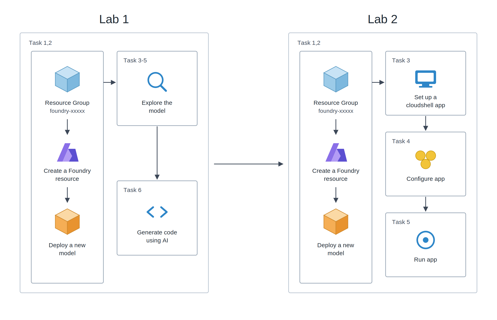
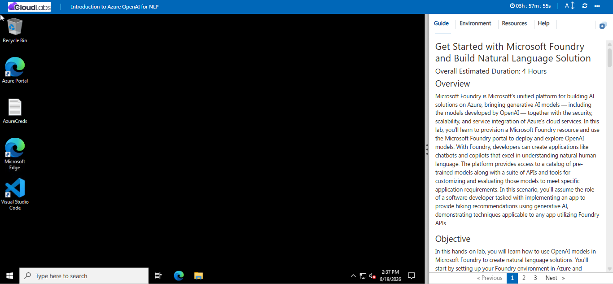
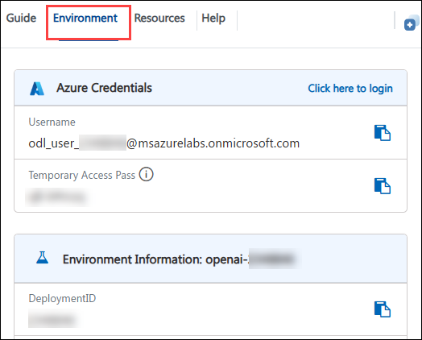

# 🚀 Get Started with Microsoft Foundry and Build Natural Language Solution

### ⏱️ Overall Estimated Duration: 4 Hours

## 📘 Overview

Microsoft Foundry is Microsoft's unified platform for building AI solutions on Azure, bringing generative AI models — including the models developed by Microsoft Foundry  — together with the security, scalability, and service integration of Azure's cloud services. In this lab, you'll learn to provision a Microsoft Foundry resource and use the Microsoft Foundry portal to deploy and explore Microsoft Foundry  models. With Foundry, developers can create applications like chatbots and copilots that excel in understanding natural human language. The platform provides access to a catalog of pre-trained models along with a suite of APIs and tools for customizing and evaluating those models to meet specific application requirements. In this scenario, you'll assume the role of a software developer tasked with implementing an app to provide hiking recommendations using generative AI, demonstrating techniques applicable to any app utilizing Foundry APIs.

## 🎯 Objective

In this hands-on lab, you will learn how to use Microsoft Foundry  models in Microsoft Foundry to create natural language solutions. You’ll start by setting up your Foundry environment in Azure and exploring the basic features of Microsoft Foundry  models for language processing. By the end of the lab, you’ll build and deploy a simple application that can process and respond to user input, while also learning how to enhance the model’s performance and output quality.

- **Get started with Microsoft Foundry:** This hands-on lab aims to provision a Microsoft Foundry resource and deploy an Microsoft Foundry  model. Explore the model's capabilities in the Chat playground, fine-tune responses by adjusting instructions, prompts, and parameters, and leverage code generation to automate tasks.
- **Use Microsoft Foundry  SDKs in your App:** This hands-on lab aims to review a Microsoft Foundry resource and its deployed model, set up and configure an application in Cloud Shell, and then run the application, demonstrating the full lifecycle from resource creation to application deployment and execution.

## 📋 Pre-requisites

- Familiarity with Microsoft Foundry, Azure CLI, and REST APIs
- Basic understanding of AI and machine learning concepts

## 🏗️ Architecture

The architecture flow for this task begins with provisioning a Microsoft Foundry resource within your Azure subscription and deploying a pre-trained Microsoft Foundry  model using the Microsoft Foundry portal. Next, you'll test the model's conversational abilities in the Chat playground, experimenting with different instructions, prompts, and parameters to customize responses. You'll also investigate the model's code-generation capabilities. In the application development phase, you'll set up your application environment in Azure Cloud Shell, configure the application to integrate with the deployed model through its Foundry endpoint and key, and finally, run the application to provide hiking recommendations using generative AI.

## 🖼️ Architecture Diagram

 

## 🧩 Explanation of Components

1. **Microsoft Foundry:** Microsoft Foundry is the unified platform for building AI solutions on Azure. It provides REST API access to powerful language models and the tooling to deploy, test, and integrate them with your data, enabling customized and secure interactions.
1. **Foundry model catalog:** Offers pre-trained and customizable large language models — including Microsoft Foundry  models such as GPT — for various AI applications. These models allow for powerful AI-driven solutions by generating tailored and contextually relevant content based on well-crafted prompts.
1. **Microsoft Foundry portal:** Provides a browser-based workspace for discovering models, deploying them, and testing them interactively in the playground before you call them from your own application code.
1. **Azure CloudShell:** Azure CloudShell offers an integrated, browser-based shell experience for managing Azure resources. It provides a ready-to-use environment with pre-installed tools and access to both Bash and PowerShell.

## 🏁 Getting Started with the Lab

Welcome to the **Get Started with Microsoft Foundry and Build Natural Language Solution** Workshop!. In this lab, you will learn how to use Microsoft Foundry  models to create natural language solutions. You'll explore the basics and work on building and deploying applications that understand and process language. Let’s get started with the lab and explore the possibilities of AI.
 
## 🔓 Accessing Your Lab Environment
 
Once you're ready to dive in, your virtual machine and lab guide will be right at your fingertips within your web browser.
 

## 💻 Virtual Machine & Lab Guide
 
Your virtual machine is your workhorse throughout the workshop. The lab guide is your roadmap to success.
 
## 🔍 Exploring Your Lab Resources
 
To get a better understanding of your lab resources and credentials, you can navigate to the **Environment** tab.
 

## 🪟 Utilizing the Split Window Feature
 
For convenience, you can open the lab guide in a separate window by selecting the **Split Window** button from the Top right corner.
 

 
## ⚙️ Managing Your Virtual Machine
 
Feel free to **Start, Stop, or Restart (2)** your virtual machine as needed from the **Resources (1)** tab. Your experience is in your hands!
 

## 🔎 Lab Guide Zoom In/Zoom Out

To adjust the zoom level for the environment page, click the **A↕: 100%** icon located next to the timer in the lab environment.

## ✅ Lab Validation

After completing the task, hit the **Validate** button under the Validation tab integrated within your lab guide. If you receive a success message, you can proceed to the next task; if not, carefully read the error message and retry the step, following the instructions in the lab guide.

## 🌐 Let's Get Started with Azure Portal
 
1. In the LabVM, click on the **Azure portal** shortcut of the Microsoft Edge browser, which is created on the desktop.

   .png)
 
1. You'll see the **Sign into Microsoft Azure** tab. Here, enter your credentials:
 
   - **Email/Username:** <inject key="AzureAdUserEmail"></inject>
 
       
 
4. Next, provide your password:
 
   - **Password:** <inject key="AzureAdUserPassword"></inject>
 
       
 
7. If prompted to **Stay Signed in**, you can click **No**.
 
8. If a **Welcome to Microsoft Azure** page appears, simply click **Cancel** to skip the tour.

## 🆘 Support Contact

The CloudLabs support team is available 24/7, 365 days a year, via email and live chat to ensure seamless assistance at any time. We offer dedicated support channels tailored specifically for both learners and instructors, ensuring that all your needs are promptly and efficiently addressed.

Learner Support Contacts:

- Email Support: cloudlabs-support@spektrasystems.com
- Live Chat Support: https://cloudlabs.ai/labs-support

Now, click on **Next** from the lower right corner to move on to the next page.

## 🎉 Happy Learning!!
