# Lab 01: Get started with Microsoft Foundry 

### Estimated Duration: 120 Minutes

## 📘 Scenario

Your organization is starting its generative AI journey, and as the cloud developer on the AI team you have been asked to set up the platform the rest of the team will build on. You begin by provisioning a Microsoft Foundry resource in the Azure portal and deploying the **gpt-5-mini** model with your own deployment type, rate limit, and guardrail settings. You then open the Playground to test the deployment, shaping its behavior with system instructions and few-shot examples, and adjust parameters such as **max completion tokens** and **reasoning effort** to see how they change the length and depth of responses. Finally, you switch the model into a developer role and have it generate a Python function, confirming the deployment is ready for the application work in the labs that follow

## 📖 overview

In this lab, you'll learn how to get started with Microsoft Foundry by provisioning the service as an Azure resource and using the Microsoft Foundry portal to deploy and explore Microsoft Foundry models. Microsoft Foundry brings the generative AI models developed by OpenAI to the Azure platform, enabling you to develop powerful AI solutions that benefit from the security, scalability, and integration of services provided by the Azure cloud platform. 

## 🎯 Objectives
In this lab, you will complete the following tasks:

- Task 1: Provision a Microsoft Foundry resource
- Task 2: Deploy a model
- Task 3: Use the Playground
- Task 4: Explore prompts and parameters 
- Task 5: Explore code generation

## Task 1: Provision a Microsoft Foundry resource

In this task, you'll create a Microsoft Foundry in the Azure portal, selecting the Microsoft Foundry resource and configuring settings such as region and pricing tier. This setup allows you to integrate Microsoft Foundry 's advanced language models into your applications.

1. In the **Azure portal**, search for **Foundry (1)** and select **Microsoft Foundry (2)**.

   

2. On **Microsoft Foundry**, click on **Foundry (1)** blade and then click on **+ Create (2)**

   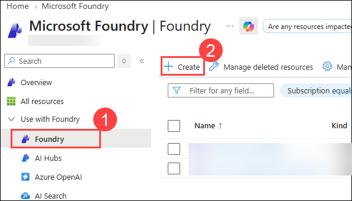

3. Fill in the required details on the **Create a Foundry resource** page:
   
    - Subscription: Default - Pre-assigned subscription **(1)**
    - Resource group: **openai-<inject key="DeploymentID" enableCopy="false"></inject> (2)**
    - Name: **Foundry-Lab-<inject key="DeploymentID" enableCopy="false"></inject> (3)**
    - Region: Select **<inject key="Region" enableCopy="false" /> (4)**
    - Default project name: **proj-default (5)**
  
      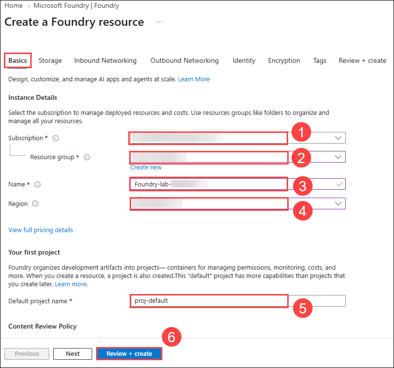

4. Click **Review + create (6)** tab.

5. Finally on the **Review + create** tab, Verify the **Basics values (1)** and click **Create (2)** to start the deployment.

     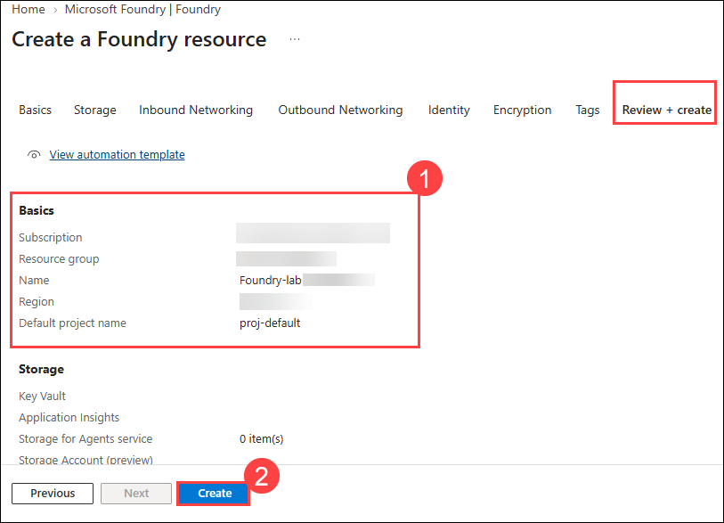

5. Wait for the deployment to complete, then go to the deployed resource from the notification pane.

> **Congratulations** on completing the task! Now, it's time to validate it. Here are the steps:
- Hit the Validate button for the corresponding task.
- If you receive a success message, you can proceed to the next task.
- If not, carefully read the error message and retry the step, following the instructions in the lab guide.
- If you need any assistance, please contact us at cloudlabs-support@spektrasystems.com. We are available 24/7 to help you out.

<validation step="c441612f-1977-44cb-832a-796990d2ff0c" />

## Task 2: Deploy a model 

In this task, you'll deploy a specific AI model instance within your Microsoft Foundry resource to integrate advanced language capabilities into your applications.

1. In the Microsoft Foundry resource pane, click on **Go to Foundry portal**, which will navigate to **New Foundry**.

    

1. You will land on the **Foundry** portal home page. If the new Foundry experience is not enabled, turn on the **New Foundry (1)** toggle. Copy the **Azure OpenAI endpoint (2)** and **API key (3)** values into a notepad — you will need them later in this lab.

    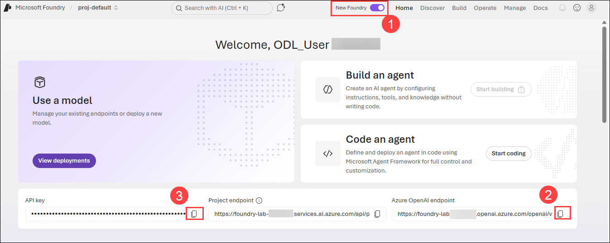

1. From the top bar, select the **Discover (1)** tab, then select **Models (2)** in the left pane. In the search bar, type **gpt-5-mini (3)** and select the **gpt-5-mini (4)** model from the results.

    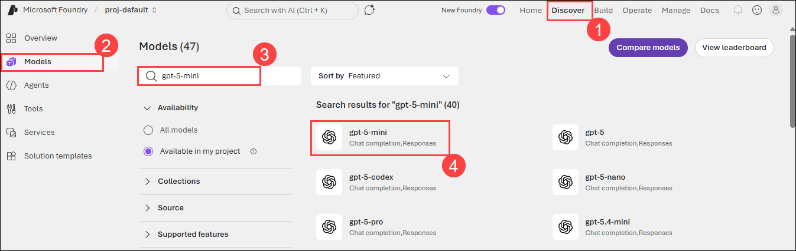

1. The model overview page opens. In the right pane, select the **Deploy (1)** drop-down and choose **Custom settings (2)**, which lets you specify your own SKU, deployment type, TPM, and other options.

    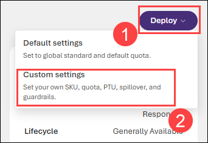

1. IIn the **Model settings** pane, enter the following values, then select **Deploy**:

      - **Deployment name (1)**: `gpt-5-mini` (you can keep the model name or enter a custom name such as `my-gpt-model`)
      - **Deployment type (2)**: **Global Standard**
      - **Tokens per Minute Rate Limit (3)**: **10K** (use the **slider (4)** to adjust the value)
      - **Guardrails (5)**: **DefaultV2**

      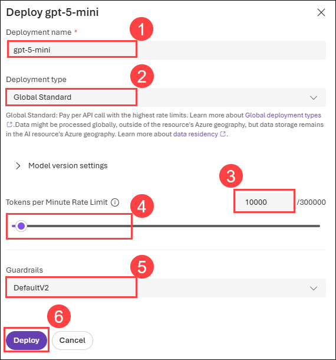

      > **Note:** You can ignore any error related to the assignment of roles to view the quota limits.
   
      > **Note:** Microsoft Foundry includes multiple models, each optimized for a different balance of capabilities and performance. In this exercise, you'll use the **gpt-5-mini** model, which is a good model for summarizing and generating natural language and code. For more information about the available models in Microsoft Foundry , see [Models](https://learn.microsoft.com/azure/ai-foundry/concepts/models) in the Microsoft Foundry documentation.


> **Congratulations** on completing the task! Now, it's time to validate it. Here are the steps:
- Hit the Validate button for the corresponding task.
- If you receive a success message, you can proceed to the next task.
- If not, carefully read the error message and retry the step, following the instructions in the lab guide.
- If you need any assistance, please contact us at cloudlabs-support@spektrasystems.com. We are available 24/7 to help you out.

<validation step="70feac4b-7ee0-42a0-9c82-384c63b69f6e" />
   
## Task 3: Use the Playground

In this task, you'll use the Playground to interact and test the AI model's conversational abilities through a simulated chat interface.

1. Once the model is deployed, you are taken to the model page under the **Deployments** or **Models** **(1)** tab in the left pane. Make sure the correct **model deployment (3)** is selected under **Playground (2)** tab. In the **Instructions (4)** box, you can provide a system message that tells the model how to behave in response to the prompts you send.


      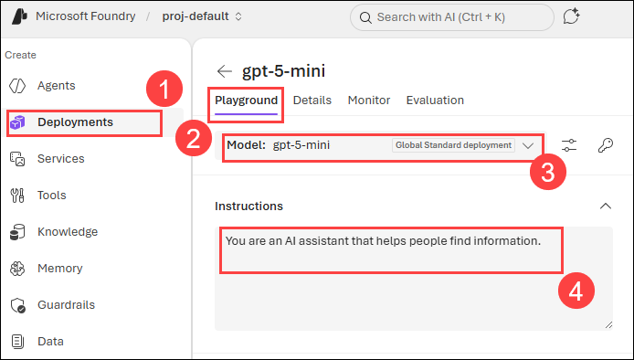

1. On the model page, make sure the **Playground** tab is selected. The playground lets you experiment with the model and test its capabilities. In the **Instructions** box, you can provide a system message that tells the model how to behave in response to the prompts you send.

      - Existing text - `You are an AI assistant that helps people find informations`. 

      - Replace the existing text with the following statement: `The system is an AI teacher that helps people learn about AI` 

      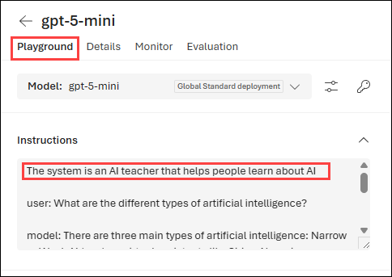

1. Along with the system message, you can also add examples in the **Instructions** box to show the model the style, tone, or format you want in its responses.

      - **User:** `What are the different types of artificial intelligence?`
    
      - **Model:** `There are three main types of artificial intelligence: Narrow or Weak AI (such as virtual assistants like Siri or Alexa, image recognition software, and spam filters), General or Strong AI (AI designed to be as intelligent as a human being. This type of AI does not currently exist and is purely theoretical), and Artificial Superintelligence (AI that is more intelligent than any human being and can perform tasks that are beyond human comprehension. This type of AI is also purely theoretical and has not yet been developed).`

      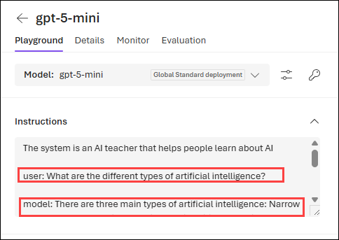

      > **Note:** Few-shot examples are used to provide the model with examples of the types of responses that are expected. The model will attempt to reflect the tone and style of the examples in its own responses.

1. In the query box at the bottom of the page, enter the text **`What is artificial intelligence?`**. Press **Enter** or use the **Send** button to submit the message and view the response.

      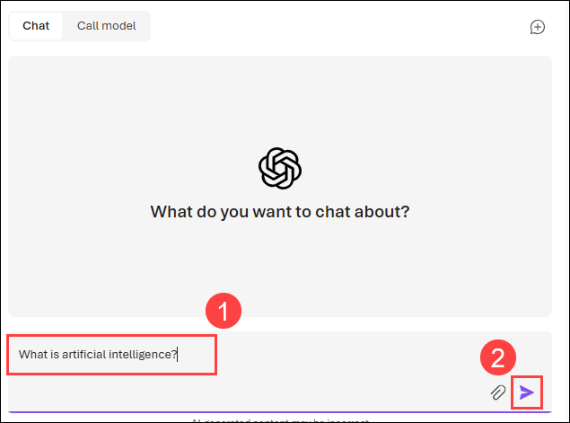 

1. Review the response and then submit the following message to continue the conversation: **`How is it related to machine learning?`**

1. Use the **Call modal (1)** toggle to view the **code (2)** for the interaction.

      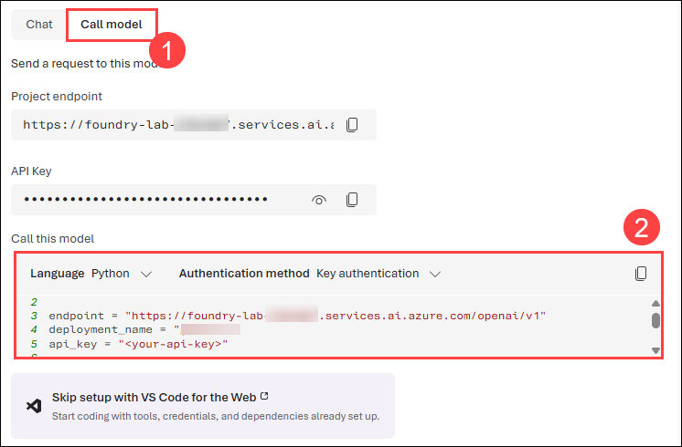

1. The **Call modal** panel shows Python code like the following, which connects to your deployed model and sends a prompt to it.

   ``` 
   from openai import OpenAI

   endpoint = "https://<resource-name>.services.ai.azure.com/openai/v1"
   deployment_name = "gpt-5-mini"
   api_key = "<your-api-key>"

   client = OpenAI(
    base_url=endpoint,
    api_key=api_key
   )

   response = client.responses.create(
    model=deployment_name,
    input="What is the capital of France?",
   )

   print(f"answer: {response.output[0]}")
   ```

## Task 4: Explore prompts and parameters

In this task, you'll explore prompts and parameters by experimenting with different inputs and settings to fine-tune the AI model's responses and behavior.

1. In the **Playground** pane, go to **Parameters (1)** and set the value:

   - max completion tokens: **400** **(3)** by using the **slider (2)** to adjust the values.
  
     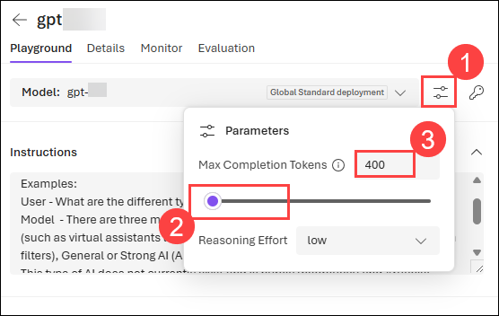
      
2. In the chat input box, enter the message and click **Submit** to send it.

      ```
      Write a 500-word explanation of how DNS resolution works, step by step. 
      ```

3. Review the chat, which shows your **user prompt (1)** and the model's **response (2)**. Although you asked for a 500-word explanation, the response is cut short because you set **max completion tokens** to **400** in the previous step.

   >**Note**: **Max completion tokens** caps how long the model's reply can be — it's an upper bound on the number of tokens the model is allowed to generate for a single response.

      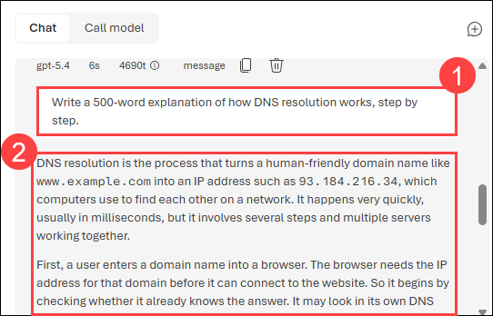

4. Generation stops early and the playground displays a **Token limit reached (1)** message, because the reply hit the **max completion tokens** limit. Now raise **max completion tokens** above **500** and resubmit the same prompt — this time the model has enough room to finish the full explanation. 

   - Click **New chat (2)** to start a fresh chat session. This clears the current conversation, so the previous messages are no longer available.

      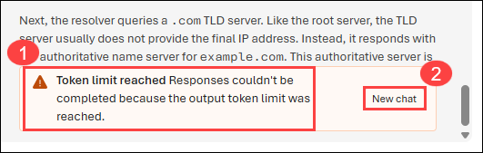

5. Observe the following about the prompt and parameters you used:

      - The prompt specifically states the content and length you want: a step-by-step explanation of DNS resolution, in about 500 words.

      - The parameters include *Max completion tokens*, which sets an upper limit on how many tokens the model can generate in a single response. Because 400 tokens is roughly 300 words, the limit was reached before the model could deliver the 500 words the prompt asked for.

      - When a parameter and a prompt disagree, the parameter wins. No matter how the prompt is worded, the model cannot produce more output than *Max completion tokens* allows — which is why raising the limit was necessary to get the complete explanation.

6. We add another value called **Reasoning Effort (1)** with high,medium,low  you can change this values and give the prompt **(2)** and click **Send (3)** to check Reasoning skills of AI model. 

   ``` 
   Three friends — Alex, Bel, and Cass — each have a different pet (cat, dog, bird)
   and live on a different floor (1, 2, 3) of an apartment building.
   - The person with the dog does not live on floor 1.
   - Alex does not live directly above or below Bel.
   - Cass does not have the bird.
   - The person on floor 2 has the cat.
   - Bel does not live on floor 3.
   Who has which pet, and on which floor? 
   ```

   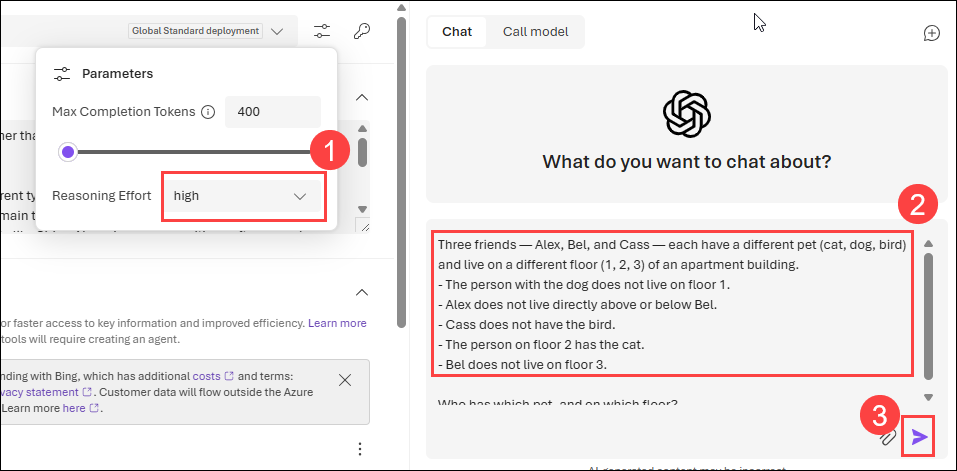

7. Review the model's response, which appears in the chat below your prompt. Then resubmit the same puzzle with a different **Reasoning effort** setting and compare the results higher effort generally produces more thorough, step-by-step reasoning, while lower effort returns a shorter answer more quickly.

   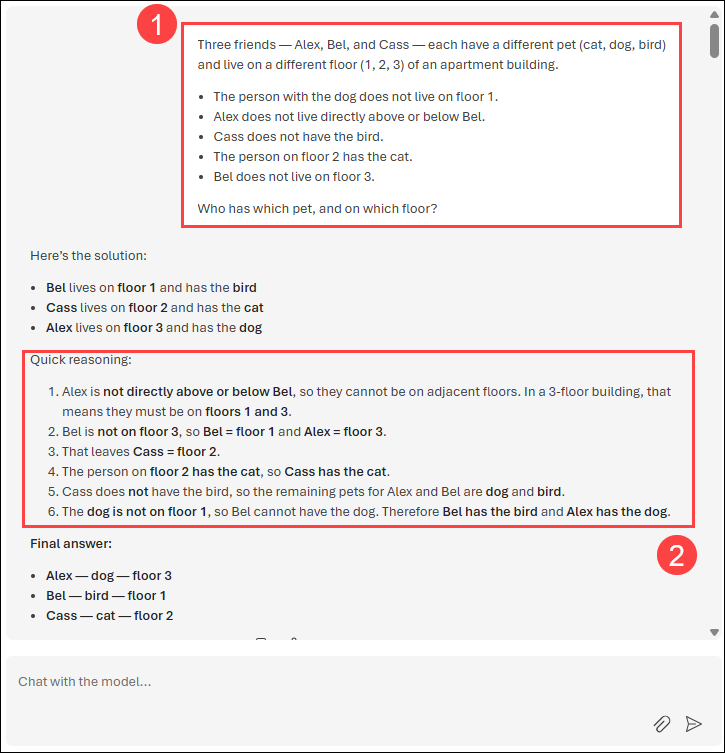

## Task 5: Explore code generation

In this task, you'll explore code generation by testing the AI model’s ability to generate and suggest code snippets based on various programming prompts and requirements.

1. Click the **New chat** icon in the top-right corner of the playground to clear the current conversation and start a fresh interaction.

   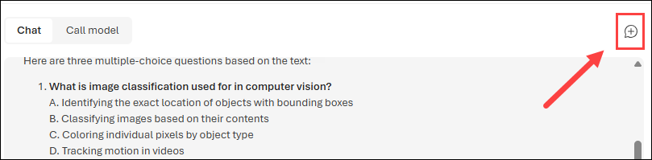

1. In the **Playground** pane, update the **Instructions (1)** to:

   ```
   You are a Python developer.
   ```

4. Enter the following **prompt (2)**:

      ```
      Write a Python function named Multiply that multiplies two numeric parameters.
      ```
      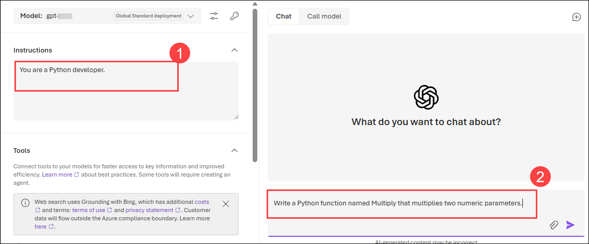

5. Review the generated Python code snippet. The model should return a valid function definition that multiplies two inputs and returns the result.

     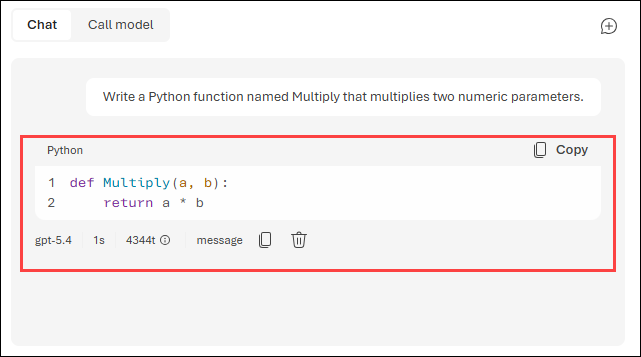


## Summary

In this lab, you provisioned an Microsoft Foundry resource, deployed a model using Azure Microsoft Foundry, and explored its capabilities in the Playground, including testing prompts, adjusting parameters, and evaluating the model’s ability to generate code for your applications.

### You have successfully completed the lab. Click on **Next >>** to proceed with the next lab.

### Happy Learning!!!
     
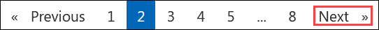
