#  Lab 01: Get started with Microsoft Foundry

### Estimated Duration: 120 Minutes

## 📘Lab Scenario

You have recently joined **Contoso**, an organization that wants to bring generative AI into its internal learning platform. Learners currently rely on static course material, and the training team wants to know whether an AI assistant could answer questions in natural language, explain technical concepts on demand, and even help developers with sample code.

Before any application is built, your manager has asked you to evaluate the platform itself. In this lab, you will take on the role of an **AI developer** responsible for that evaluation: you'll provision a **Microsoft Foundry** resource in the Azure subscription, deploy a model, and validate its behaviour hands-on in the **Microsoft Foundry portal** playground shaping the assistant's persona with instructions and few-shot examples, controlling response length and depth with parameters such as *max completion tokens* and *reasoning effort*, and confirming that the model can generate usable code.

By the end of the lab, you'll have a working, tested model deployment along with the **project endpoint** and **API key** your team needs to call it from application code in the next lab.

## 📖 Lab Overview

In this lab, you'll learn how to get started with **Microsoft Foundry** by provisioning a Foundry resource in Azure and using the Microsoft Foundry portal to deploy and explore generative AI models. Microsoft Foundry is the unified platform for building AI solutions on Azure  it gives you a single place to discover models, deploy them, test them interactively in the playground, and connect them to your own applications, all backed by the security, scalability and service integration of the Azure cloud platform. 

## 🎯 Lab Objectives
In this lab, you will complete the following tasks:

- Task 1: Provision a Microsoft Foundry resource
- Task 2: Deploy a model
- Task 3: Use the Chat playground
- Task 4: Explore prompts and parameters 
- Task 5: Explore code generation

## Task 1: Provision a Microsoft Foundry resource

In this task, you'll create an Azure resource in the Azure portal, selecting the Microsoft Foundry resource and configuring settings such as region and pricing tier. This setup allows you to integrate Microsoft Foundry 's advanced language models into your applications.

1. In the **Azure portal**, search for **Foundry (1)** and select **Microsoft Foundry (2)**.

   

2. On **Microsoft Foundry**, click on **Foundry (1)** blade and then click on **+ Create (2)**

   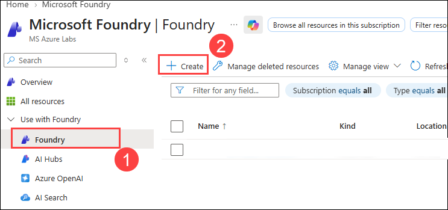

3. Fill in the required details on the **Create a Foundry resource** page:
   
    - Subscription: Default - Pre-assigned subscription **(1)**
    - Resource group: **foundry-<inject key="DeploymentID" enableCopy="false"></inject> (2)**
    - Name: **Foundry-lab-<inject key="DeploymentID" enableCopy="false"></inject> (3)**
    - Region: Select **<inject key="Region" enableCopy="false" /> (4)**
    - Default project name: **proj-default (5)**
  
      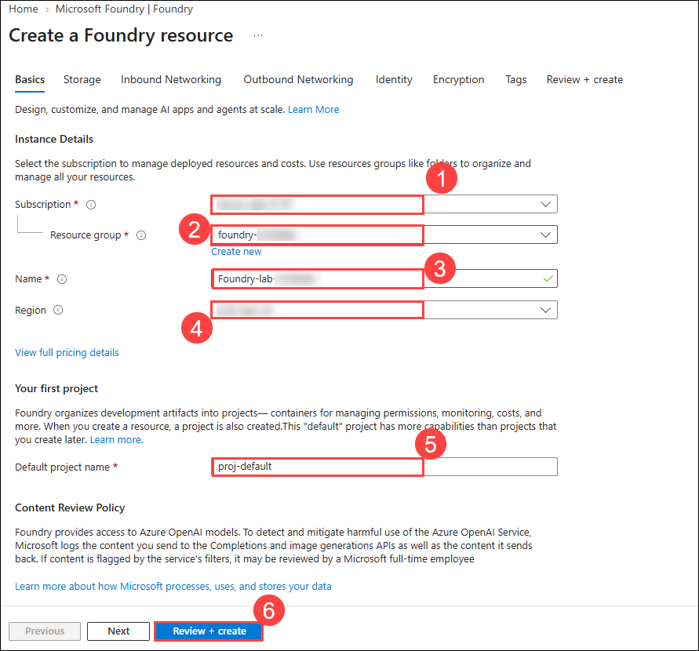

4. Click **Review + create (6)** tab.

5. Finally, click **Create** to start the deployment.

     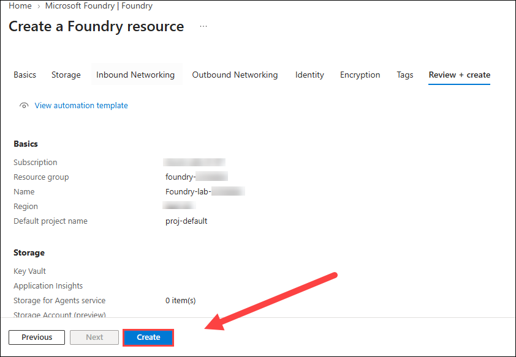

5. Wait for the deployment to complete, then go to the deployed resource from the notification pane.

> **Congratulations** on completing the task! Now, it's time to validate it. Here are the steps:
> - Hit the Validate button for the corresponding task. If you receive a success message, you can proceed to the next task. 
> - If not, carefully read the error message and retry the step, following the instructions in the lab guide. 
> - If you need any assistance, please contact us at cloudlabs-support@spektrasystems.com. We are available 24/7 to help you out.

<validation step="1cf5027a-766c-491a-a0d3-8440fec9e748" />

## Task 2: Deploy a model

In this task, you'll deploy a specific AI model instance within your Microsoft Foundry resource to integrate advanced language capabilities into your applications.

1. From the **Azure portal**, navigate to your foundry resource **Foundry-lab-<inject key="DeploymentID" enableCopy="false"></inject>**.

1. On the **Foundry** resource page, click **Overview**, then select **Go to Microsoft Foundry portal** to navigate to the **Microsoft Foundry portal**.

   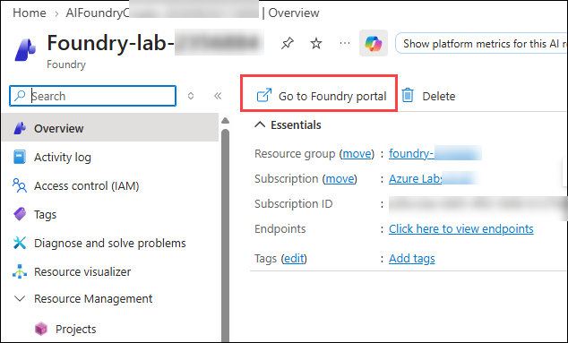

1. You'll land on the new **Microsoft Foundry** portal. Ensure the **toggle (1)** is turned on  if it's disabled, enable it. Then copy the following values into Notepad, as you'll need them in later steps:

   - Project Endpoint **(2)** 
   - API key **(3)**

   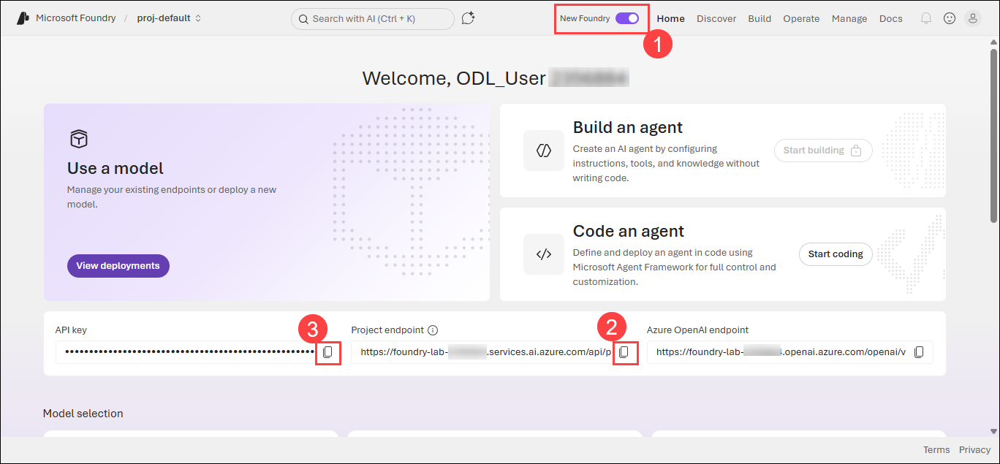

1. Navigate to the top of the page and click **Discover (1)**, then choose **Models (2)** from the left sidebar. Next, search for **gpt-5.4 (3)** and select **(4)** it from the results.

   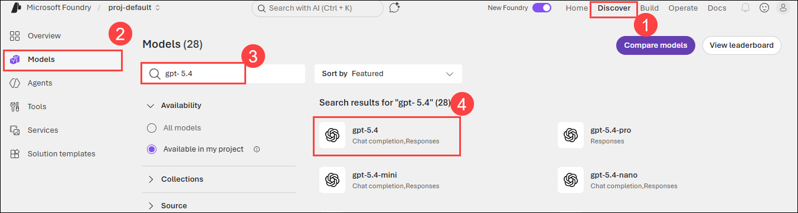

1. On the model details page, click **Deploy (1)** and select **Custom settings (2)**.
   
   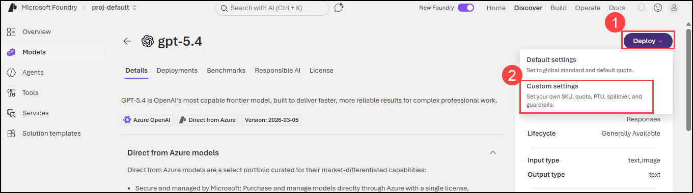

1. Within the **Deploy model** pop-up interface, enter the following details:

      - Deployment name: **gpt-5.4 (1)**
      - Deployment type: **Global Standard (2)**
      - Tokens per Minute Rate Limit (thousands): **10K (3)** use slider to adjust the tokens
      - Content filter: **DefaultV2**
      - Click on **Deploy** **(4)**
  
           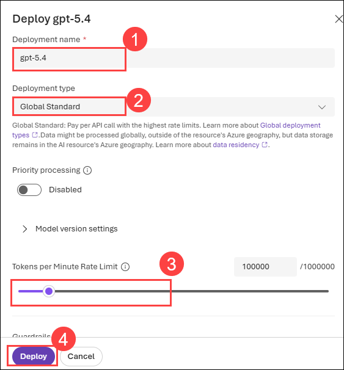

           >**Note**: Set the Tokens per Minute Rate Limit to a maximum of 10K. Exceeding this limit will cause the model deployment to fail. 

1. With the deployed model, now you can experiment with the chat completion tasks as you go along.
 
> **Congratulations** on completing the task! Now, it's time to validate it. Here are the steps
> - Hit the Validate button for the corresponding task. If you receive a success message, you can proceed to the next task. 
> - If not, carefully read the error message and retry the step, following the instructions in the lab guide.
> - If you need any assistance, please contact us at cloudlabs-support@spektrasystems.com. We are available 24/7 to help you out.

<validation step="6be846c2-8a90-4683-97e8-b55309a5b10e" />

## Task 3: Use the Playground

In this task, you'll use the Playground to interact with and test the AI model's conversational abilities through a simulated chat interface.

1. Once the model is deployed, you'll be taken to the model **Playground**, where you can test it by providing instructions and prompts, review the responses it generates, and explore more of the model's AI capabilities.

   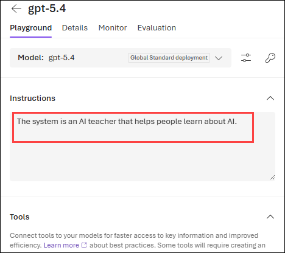

   > **Note**: Depending on your screen size, the **Instructions** section may be collapsed under a **Setup** tab. If so, click **Setup** to open it.

2. In th **Playground** tab under we can see the **Instructions** section which is similar to **system message**:

   * Replace the default **Instruction** with the following instruction:

     ```
     The system is an AI teacher that helps people learn about AI.
     ```

      
   
1. Next, add examples in the **Instructions** section. Examples show the model the format you expect, so it can shape its responses to match.

1. Enter the following message and response in the designated boxes:

      - **User**:
        ```
        What are the different types of artificial intelligence?
        ```
    
      - **Model**:
        ```
        There are three main types of artificial intelligence: Narrow or Weak AI (such as virtual assistants like Siri or Alexa, image recognition software and spam filters), General or Strong AI (AI designed to be as intelligent as a human being. This type of AI does not currently exist and is purely theoretical) and Artificial Superintelligence (AI that is more intelligent than any human being and can perform tasks that are beyond human comprehension. This type of AI is also purely theoretical and has not yet been developed).
        ``` 

         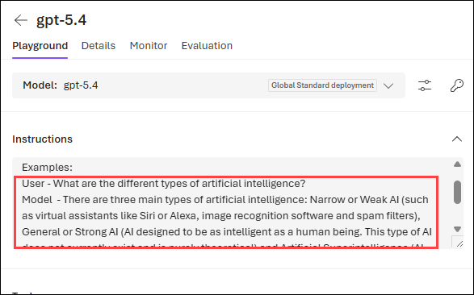
   
         > **Note**: Few-shot examples are used to provide the model with examples of the types of responses that are expected. The model will attempt to reflect the tone and style of the examples in its own responses.
   
1. In the query box at the bottom of the page, enter the below-mentioned text **(1)**. Use the **Send (2)** button to submit the message and view the response in the **Chat** interface.

   ```
   What is artificial intelligence?
   ```

   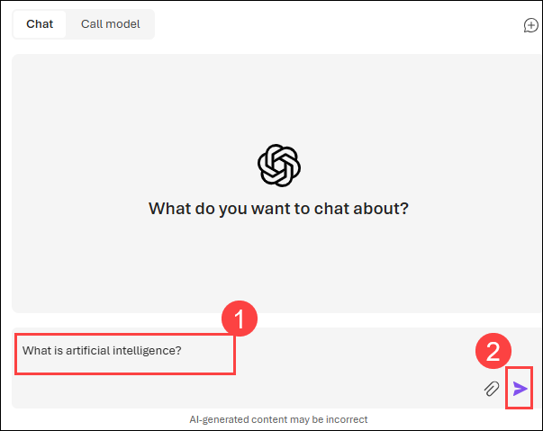

1. Review the chat, where your **user prompt (1)** and the model's **response (2)** are displayed.

   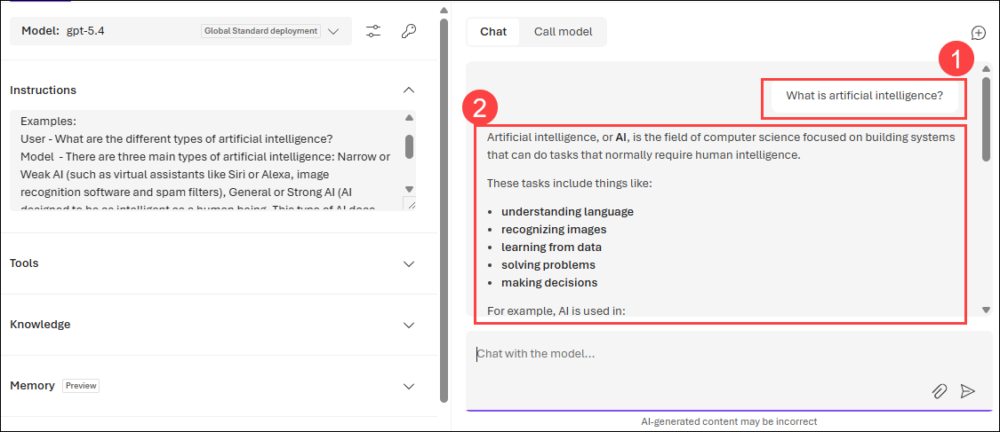

1. After reviewing the response, submit the following follow-up message:

   ```
   `How is it related to machine learning?`
   ```

1. Review the response, noting that context from the previous interaction is retained (so the model understands that "it" refers to artificial intelligence).

1. Use the **Call modal (1)** toggle to view the **code (2)** for the interaction.

1. The **Call modal** panel shows Python code like the following, which connects to your deployed model and sends a prompt to it.

   ``` 
   from openai import OpenAI

   endpoint = "https://<resource-name>.services.ai.azure.com/openai/v1"
   deployment_name = "gpt-5.4"
   api_key = "<your-api-key>"

   client = OpenAI(
    base_url=endpoint,
    api_key=api_key
   )

   response = client.responses.create(
    model=deployment_name,
    input="What is the capital of France?",
   )

   print(f"answer: {response.output[0]}")
   ```

   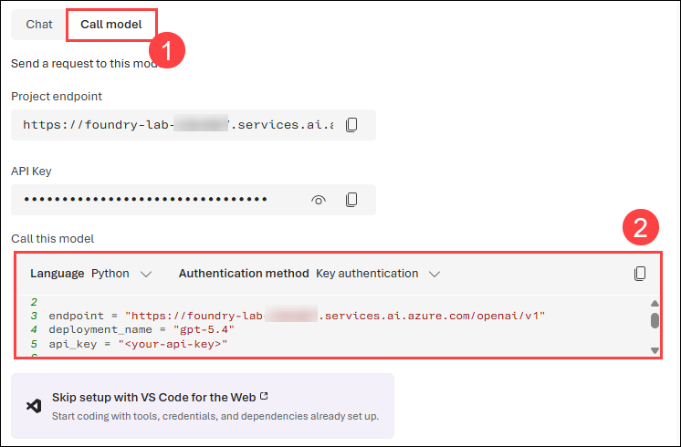

## Task 4: Explore prompts and parameters

In this task, you'll explore prompts and parameters by experimenting with different inputs and settings to fine-tune the AI model's responses and behavior.

1. In the **Playground** pane, go to **Parameters (1)** and set the value:

   - max completion tokens: **400** **(3)** by using the **slider (2)** to adjust the values.
  
     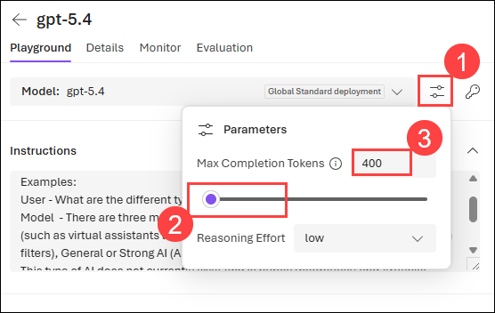
      
2. In the chat input box, enter the message and click **Submit** to send it.

      ```
      Write a 500-word explanation of how DNS resolution works, step by step. 
      ```

3. Review the chat, which shows your **user prompt (1)** and the model's **response (2)**. Although you asked for a 500-word explanation, the response is cut short because you set **max completion tokens** to **400** in the previous step.

   >**Note**: **Max completion tokens** caps how long the model's reply can be — it's an upper bound on the number of tokens the model is allowed to generate for a single response.

      

4. Generation stops early and the playground displays a **Token limit reached (1)** message, because the reply hit the **max completion tokens** limit. Now raise **max completion tokens** above **500** and resubmit the same prompt — this time the model has enough room to finish the full explanation. 

   - Click **New chat (2)** to start a fresh chat session. This clears the current conversation, so the previous messages are no longer available.

      

5. Observe the following about the prompt and parameters you used:

      - The prompt specifically states the content and length you want: a step-by-step explanation of DNS resolution, in about 500 words.

      - The parameters include *Max completion tokens*, which sets an upper limit on how many tokens the model can generate in a single response. Because 400 tokens is roughly 300 words, the limit was reached before the model could deliver the 500 words the prompt asked for.

      - When a parameter and a prompt disagree, the parameter wins. No matter how the prompt is worded, the model cannot produce more output than *Max completion tokens* allows — which is why raising the limit was necessary to get the complete explanation.

6. We add another value called **Reasoning Effort (1)** with high,medium,low  you can change this values and give the prompt **(2)** and click **Send (3)** to check Reasoning skills of AI model. 

   ``` 
   Three friends — Alex, Bel, and Cass — each have a different pet (cat, dog, bird)
   and live on a different floor (1, 2, 3) of an apartment building.
   - The person with the dog does not live on floor 1.
   - Alex does not live directly above or below Bel.
   - Cass does not have the bird.
   - The person on floor 2 has the cat.
   - Bel does not live on floor 3.
   Who has which pet, and on which floor? 
   ```

   

7. Review the model's response, which appears in the chat below your prompt. Then resubmit the same puzzle with a different **Reasoning effort** setting and compare the results — higher effort generally produces more thorough, step-by-step reasoning, while lower effort returns a shorter answer more quickly.

   

## Task 5: Explore code generation

In this task, you'll explore code generation by testing the AI model’s ability to generate and suggest code snippets based on various programming prompts and requirements.

1. Click the **New chat** icon in the top-right corner of the playground to clear the current conversation and start a fresh interaction.

   

1. In the **Playground** pane, update the **Instructions (1)** to:

   ```
   You are a Python developer.
   ```

4. Enter the following **prompt (2)**:

      ```
      Write a Python function named Multiply that multiplies two numeric parameters.
      ```
      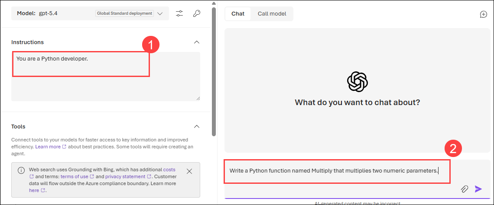

5. Review the generated Python code snippet. The model should return a valid function definition that multiplies two inputs and returns the result.

     

## 📝 Summary

In this lab,
- You provisioned an **Microsoft Foundry resource** to integrate generative AI capabilities into your applications.
- You **deployed a model** (gpt-5.4 for chat completion) using the Microsoft Foundry portal.
- You explored the model in the **Playground**, experimented with prompts and parameters and tested the model’s **code generation abilities**.


###  You have successfully completed the lab. Click on Next >> to proceed with the next lab.
     
   
