# Lab 02: Build an App with Microsoft Foundry OpenAI SDKs

### Estimated Duration: 120 Minutes

## Lab Overview

In the lab, you will perform the role of a software developer who has been tasked to implement an app that can use generative AI to help provide hiking recommendations. The techniques used in the exercise can be applied to any app that utilizes Foundry APIs.

With **Microsoft Foundry**, developers can create chatbots, copilots, and other applications that excel at understanding natural human language. Foundry gives you a catalog of pre-trained models — including OpenAI models such as GPT — along with a suite of APIs and tools for deploying, customizing, and evaluating those models to meet the specific requirements of your application. In this exercise, you'll learn how to call an OpenAI model deployed in Microsoft Foundry from your own application code.

## Lab Objectives

In this lab, you will complete the following tasks:

- Task 1: Provision a Microsoft Foundry resource
- Task 2: Set up an application in Cloud Shell
- Task 3: Configure your application
- Task 4: Test your application

## Task 1: Provision an Foundry resource

In this task, you will review the provisioned Foundry resource within your Azure subscription. This step is essential to access OpenAI models and retrieve the endpoint and API key required to authenticate your application.

1. In the **Azure portal**, search for **Foundry (1)** and select **Microsoft Foundry (2)**.

   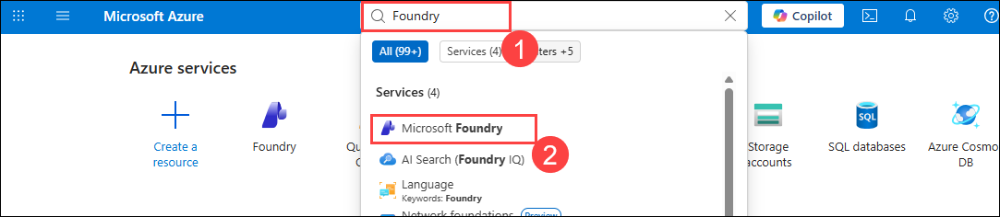

1. On the **Foundry (1)** page, select **OpenAI-Lab01-<inject key="DeploymentID" enableCopy="false"></inject>** **(2)**

   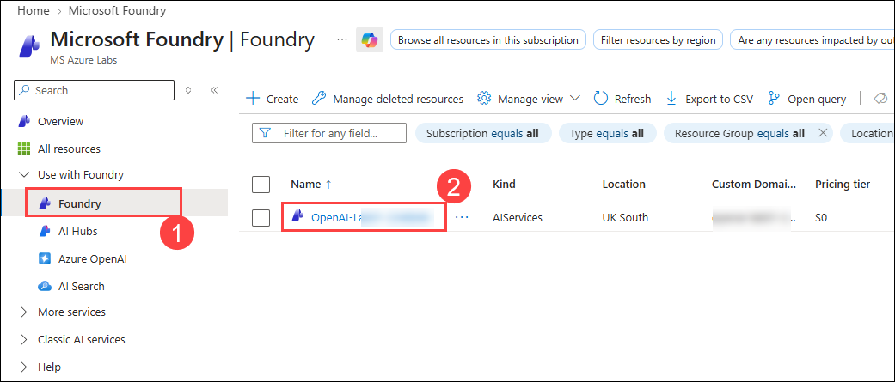

1. To capture the key and endpoint values, on the **OpenAI-Lab01-<inject key="DeploymentID" enableCopy="false"></inject>** blade:

      - In the left navigation pane, expand **Resource Management** and select **Keys and Endpoint (1)**.
      - Click **Show Keys** to reveal the key values, then use the copy icon next to **KEY 1 (2)** to copy it. Save it securely in a text editor (for example, Notepad) for use in later steps.
      - Select the **Foundry (3)** tab, then copy the **API endpoint (4)** value and save it in the same location.

        > **Note:** Make sure you copy the endpoint from the **Foundry** tab rather than the **OpenAI** or **AI Services** tab, as the application uses the Foundry project endpoint.

        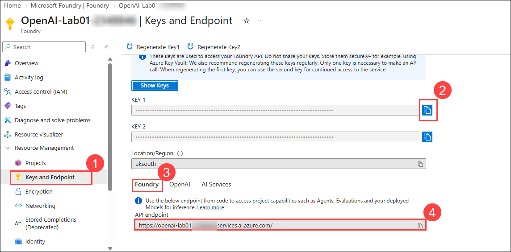

## Task 2: Set up an application in Cloud Shell

In this task, you will set up a development environment using Azure Cloud Shell. You will clone the sample application repository, prepare the workspace, and open the code editor to begin integrating Microsoft Foundry openAI services.

1. In the [Azure portal](https://portal.azure.com?azure-portal=true), select the **[>_]** (*Cloud Shell*) button at the top of the page to the right of the search box. A Cloud Shell pane will open at the bottom of the portal.

    

    >**Note:** If you can't find Cloud Shell, click on the **ellipsis (...) (1)** and then select **Cloud Shell (2)** from the menu.

    .png)

2. The first time you open the Cloud Shell, you may be prompted to choose the type of shell you want to use (*Bash* or *PowerShell*). Select **Bash**. If you don't see this option, skip the step.

    .png)

3. Within the **Getting started** page, select **Mount storage account (1)**, select your **Subscription (2)** from the dropdown and click **Apply (3)**.

   

4. Within the **Mount storage account** page, select **I want to create a storage account (1)** and click **Next (2)**.

   

5. Within the **Create storage account** page, enter the following details:

    - Subscription: Choose the Default subscription **(1)**.
    - Resource group: Select **openai-<inject key="DeploymentID" enableCopy="false"></inject> (2)**
    - Region: **<inject key="Region" enableCopy="false" /> (3)**
    - Storage account name: **storage<inject key="DeploymentID" enableCopy="false"></inject> (4)**
    - File share: Create a new file share named **none** **(5)**
    - Click **Create** **(6)**

        

6. Note that you can resize the cloud shell by dragging the separator bar at the top of the page, or by using the **&#8212;**, **&#9723;**, and **X** icons at the top right of the page to minimize, maximize, and close the pane. For more information about using the Azure Cloud Shell, see the [Azure Cloud Shell documentation](https://docs.microsoft.com/azure/cloud-shell/overview). 

8. Once the terminal is ready, Select the **Manage files (1)** and select the **upload (2)** option to open file explorer.

    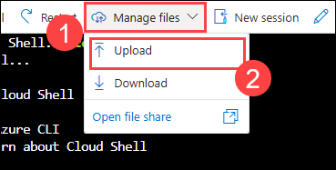 
  
9. Navigate to this path `C:\LabFiles\sdk-files\CSharp` **(1)** and select all files **(2)** using `ctrl + A` and select **open (3)** option which loads the files in cloud shell environment.

    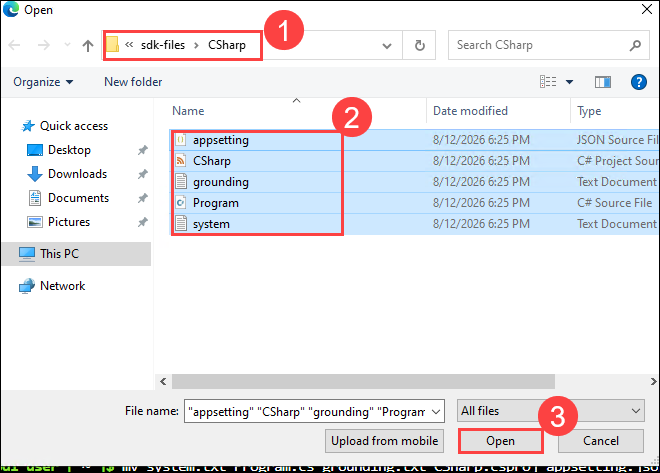

1. Navigate to this path `C:\LabFiles\sdk-files\Python` **(1)** and select all files **(2)** using `ctrl + A` and select **open (3)** option which loads the files in cloud shell environment.

    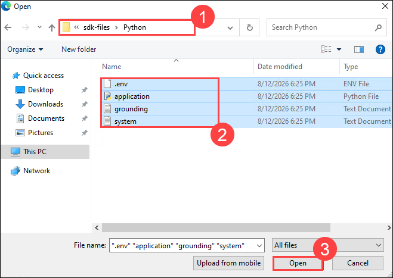

1. In cloud shell terminal create two directories CSharp,Python use below commands. 

    ``` 
    mkdir CSharp Python
    ```

1. Next move the Python files to Python folder. Run the below command.

    ```
    mv system.txt grounding.txt application.py .env ./Python
    ```

1. Next move the CSharp files to CSharp folder. Run the below command.
   
   ``` 
   mv system.txt Program.cs grounding.txt CSharp.csproj appsetting.json ./CSharp 
   ``` 

1. Applications for both C# and Python have been provided, as well as a sample text file you'll use to test the summarization. Both apps feature the same functionality.

10. Open the built-in code editor, and observe the text file that you'll be summarizing with your model. Use the following command to open the lab files in the code editor.

    ```bash
    code .
    ```

> **Congratulations** on completing the task! Now, it's time to validate it. Here are the steps:
> - Hit the Validate button for the corresponding task. If you receive a success message, you can proceed to the next task. 
> - If not, carefully read the error message and retry the step, following the instructions in the lab guide.
> - If you need any assistance, please contact us at cloudlabs-support@spektrasystems.com. We are available 24/7 to help you out.

<validation step="bd2f25c6-d67e-4553-a8ed-32e9f0162e26" />

## Task 3: Configure your application

In this task, you will configure the application to connect with the Microsoft Foundry resource. You will update configuration files with your environment credentials and implement the client logic to interact with the deployed model.

1. In the code editor, expand the **CSharp** or **Python** folder, depending on your language preference.
1. To quit the code environment, right-click anywhere and select Quit

1. If you are using the **C#** language, kindly open the **CSharp.csproj** file and replace it with the following code and save the file everytime you make any changes.

   ```
   <Project Sdk="Microsoft.NET.Sdk">

    <PropertyGroup>
        <OutputType>Exe</OutputType>
        <TargetFramework>net9.0</TargetFramework>
        <ImplicitUsings>enable</ImplicitUsings>
        <Nullable>enable</Nullable>
        <LangVersion>12</LangVersion>
    </PropertyGroup>

    <ItemGroup>
        <PackageReference Include="OpenAI" Version="2.12.0" />
        <PackageReference Include="Microsoft.Extensions.Configuration" Version="8.0.0" />
        <PackageReference Include="Microsoft.Extensions.Configuration.Json" Version="8.0.0" />
    </ItemGroup>

    <ItemGroup>
        <None Update="appsettings.json">
        <CopyToOutputDirectory>PreserveNewest</CopyToOutputDirectory>
        </None>
    </ItemGroup>

    </Project>
   ```

1. Open the configuration file for your language

    - C#: `appsettings.json`
    
    - Python: `.env`
    
1. Update the configuration values to include the **project endpoint** and **key** from the foundry resource you created, as well as the model name that you deployed, `gpt-5.4`. Then the file by right-clicking on the blank space in the file text editor and hit **Save**.

    - **C#:**
     
      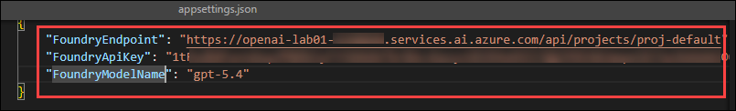   

      >**Note**: Make sure the variables like `FoundryEndpoint`,`FoundryApiKey`,`FoundryModelName` in **appsettings.json** are same used in **Program.cs** file.

    - **Python:**
     
      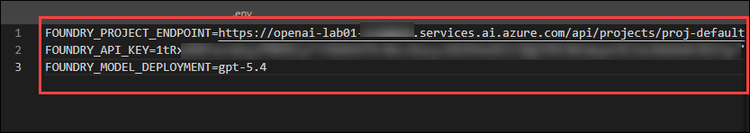 

      >**Note**: Make sure the variables name like `FOUNDRY_PROJECT_ENDPOINT`,`FOUNDRY_API_KEY`,`FOUNDRY_MODEL_DEPLOYMENT` in **.env** are same used in **application.py** file.

      > **Note:** You can get the **Project endpoint** and **API key** values from the **Overview** page of your Foundry resource in the **Microsoft Foundry portal** — these are the same values you copied to Notepad earlier.

1. Navigate back to the Cloudshell and install the necessary packages for your preferred language:

    **C#:** 

    ```bash
    cd CSharp
    dotnet add package OpenAI
    ```

    **Python:** 

    ```bash
    cd Python
    python -m venv labenv
    pip install openai python-dotenv --user
    ```

1. Navigate to your preferred language folder, replace the comment **Add OpenAI package** with code to add the OpenAI SDK library:

    **C#:** Program.cs

    ```csharp
    // Foundry OpenAI-compatible packages 
    using OpenAI;
    using OpenAI.Chat;
    ```

     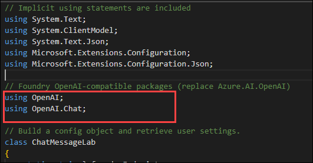 

    **Python:** application.py

    ```python
   # Use the plain (non-Azure) OpenAI async client, pointed at the Foundry endpoint
    from openai import AsyncOpenAI
    ```

     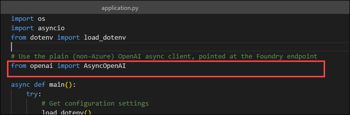      

1.  In the application code for your language, find the comment **Configure the OpenAI client**, and add code to configure the Foundry's OpenAI client:

    **C#:** Program.cs

    ```csharp
    // Configure the ChatClient to talk to Foundry's OpenAI-compatible /openai/v1 route
        ChatClient chatClient = new(
            model: foundryModelName,
            credential: new ApiKeyCredential(foundryApiKey),
            options: new OpenAIClientOptions()
            {
                Endpoint = new Uri($"{foundryEndpoint.TrimEnd('/')}/openai/v1")
            }
        );
    ```

     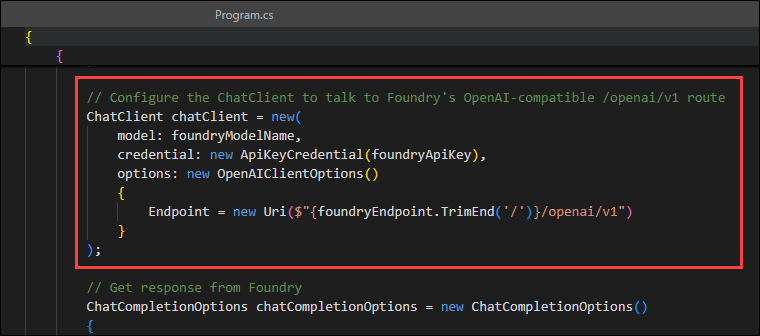  

    **Python:** application.py

    ```python
     # Configure the client to talk to Foundry's OpenAI-compatible v1 endpoint
        client = AsyncOpenAI(
            base_url=f"{foundry_endpoint.rstrip('/')}/openai/v1/",
            api_key=foundry_api_key,
        )
    ```

     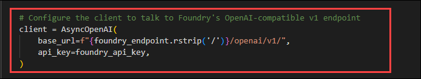   

      >**Note:** Make sure to indent the code by eliminating any extra white spaces after pasting it into the code editor.
    
1. In the function that calls the **OpenAI model**, under the comment **Get response from foundry**, add the code to format and send the request to the model.

    **C#:** Program.cs

    ```csharp
       // Get response from Foundry
        ChatCompletionOptions chatCompletionOptions = new ChatCompletionOptions()
        {
            Temperature = 0.7f,
            MaxOutputTokenCount = 800
        };

        ChatCompletion completion = chatClient.CompleteChat(
            [
                new SystemChatMessage(systemMessage),
                new UserChatMessage(userMessage)
            ],
            chatCompletionOptions
        );

        Console.WriteLine($"{completion.Role}: {completion.Content[0].Text}");
    ```

     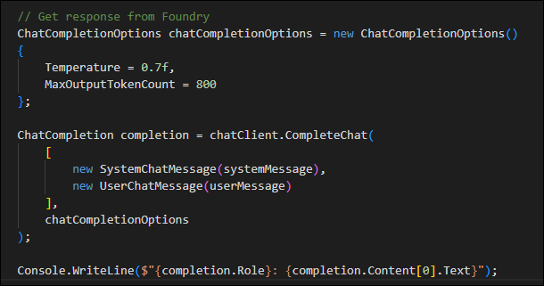      

    **Python:** application.py

    ```python
   # Define the function that will get the response from the Foundry model
    async def call_openai_model(system_message, user_message, model, client):
        messages = [
            {"role": "system", "content": system_message},
            {"role": "user", "content": user_message},
        ]

        print("\nSending request to Foundry model...\n")

        response = await client.chat.completions.create(
            model=model,
            =messages,
            temperature=0.7,
            max_completion_tokens=800
        )
        print("Response:\n" + response.choices[0].message.content + "\n")

    ```

     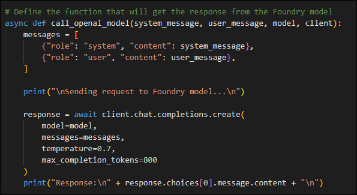  

1. Before you can save the file, please make sure your code looks similar to the code provided below.

    **C#:** Program.cs
      
    ```CSharp
    // Implicit using statements are included
    using System.Text;
    using System.ClientModel;
    using System.Text.Json;
    using Microsoft.Extensions.Configuration;
    using Microsoft.Extensions.Configuration.Json;

    // Foundry OpenAI-compatible packages 
    using OpenAI;
    using OpenAI.Chat;

    // Build a config object and retrieve user settings.
    class ChatMessageLab
    {
        static string? foundryEndpoint;
        static string? foundryApiKey;
        static string? foundryModelName;

        static void Main(string[] args)
        {
            IConfiguration config = new ConfigurationBuilder()
            .AddJsonFile("appsettings.json")
            .Build();

            foundryEndpoint = config["FoundryEndpoint"];
            foundryApiKey = config["FoundryApiKey"];
            foundryModelName = config["FoundryModelName"];

            //Initialize messages list
            do
            {
                // Pause for system message update
                Console.WriteLine("-----------\nPausing the app to allow you to change the system prompt.\nPress any key to continue...");
                Console.ReadKey();

                Console.WriteLine("\nUsing system message from system.txt");
                string systemMessage = System.IO.File.ReadAllText("system.txt");
                systemMessage = systemMessage.Trim();

                Console.WriteLine("\nEnter user message or type 'quit' to exit:");
                string userMessage = Console.ReadLine() ?? "";
                userMessage = userMessage.Trim();

                if (systemMessage.ToLower() == "quit" || userMessage.ToLower() == "quit")
                {
                    break;
                }
                else if (string.IsNullOrEmpty(systemMessage) || string.IsNullOrEmpty(userMessage))
                {
                    Console.WriteLine("Please enter a system and user message.");
                    continue;
                }
                else
                {
                    // Format and send the request to the model
                    GetResponseFromFoundry(systemMessage, userMessage);
                }
            } while (true);
        }

        // Define the function that gets the response from the Foundry v1 endpoint
        private static void GetResponseFromFoundry(string systemMessage, string userMessage)
        {
            Console.WriteLine("\nSending prompt to Foundry endpoint...\n\n");

            if (string.IsNullOrEmpty(foundryEndpoint) || string.IsNullOrEmpty(foundryApiKey) || string.IsNullOrEmpty(foundryModelName))
            {
                Console.WriteLine("Please check your appsettings.json file for missing or incorrect values.");
                return;
            }

            // Configure the ChatClient to talk to Foundry's OpenAI-compatible /openai/v1 route
            ChatClient chatClient = new(
                model: foundryModelName,
                credential: new ApiKeyCredential(foundryApiKey),
                options: new OpenAIClientOptions()
                {
                    Endpoint = new Uri($"{foundryEndpoint.TrimEnd('/')}/openai/v1")
                }
            );

            // Get response from Foundry
            ChatCompletionOptions chatCompletionOptions = new ChatCompletionOptions()
            {
                Temperature = 0.7f,
                MaxOutputTokenCount = 800
            };

            ChatCompletion completion = chatClient.CompleteChat(
                [
                    new SystemChatMessage(systemMessage),
                    new UserChatMessage(userMessage)
                ],
            chatCompletionOptions
            );

            Console.WriteLine($"{completion.Role}: {completion.Content[0].Text}");
        }
    }

    ```
    
   **Python:** application.py

      ```Python
      import os
      import asyncio
      from dotenv import load_dotenv

      # Use the plain (non-Azure) OpenAI async client, pointed at the Foundry endpoint
      from openai import AsyncOpenAI

      async def main():
          try:
              # Get configuration settings
              load_dotenv()
              foundry_endpoint = os.getenv("FOUNDRY_PROJECT_ENDPOINT")  # e.g. https://<resource-name>.services.ai.azure.com
              foundry_api_key = os.getenv("FOUNDRY_API_KEY")
              model_name = os.getenv("FOUNDRY_MODEL_DEPLOYMENT")
              # model_name = os.getenv("FOUNDRY_MODEL_DEPLOYMENT")  # your deployed GPT model name

              # Configure the client to talk to Foundry's OpenAI-compatible v1 endpoint
              client = AsyncOpenAI(
                  base_url=f"{foundry_endpoint.rstrip('/')}/openai/v1/",
                  api_key=foundry_api_key,
              )

              while True:
                  # Pause the app to allow the user to enter the system prompt
                  print("------------------\nPausing the app to allow you to change the system prompt.\nPress enter to continue...")
                  input()

                  # Read in system message and prompt for user message
                  system_text = open(file="system.txt", encoding="utf8").read().strip()
                  user_text = input("Enter user message, or 'quit' to exit: ")
                  if user_text.lower() == 'quit' or system_text.lower() == 'quit':
                      print('Exiting program...')
                      break

                  # Format and send the request to the model
                  await call_openai_model(
                      system_message=system_text,
                      user_message=user_text,
                      model=model_name,
                      client=client
                  )

          except Exception as ex:
              print(ex)

      # Define the function that will get the response from the Foundry model
      async def call_openai_model(system_message, user_message, model, client):
          messages = [
              {"role": "system", "content": system_message},
              {"role": "user", "content": user_message},
          ]

          print("\nSending request to Foundry model...\n")

          response = await client.chat.completions.create(
              model=model,
              messages=messages,
              temperature=0.7,
              max_completion_tokens=800
          )

          print("Response:\n" + response.choices[0].message.content + "\n")

      if __name__ == '__main__':
          asyncio.run(main())
      ```
    
1. To save the changes made to the file, right-click on the blank space in the file text editor and hit **Save**.

   >**Note:** Make sure to indent the code by eliminating any extra white spaces after pasting it into the code editor.

## Task 4: Test your application

In this task, you will run the application and interact with the Microsoft Foundry OpenAI model using different system and user prompts. This hands-on testing will help you observe how prompt variations affect the model’s output.

1. In the folder of your preferred language, open the **system.txt** file. For each of the interactions, you'll enter the **System message** in this file and save it. Each iteration will pause first for you to change the system message.

1. In the interactive terminal pane, ensure the folder context is the folder for your preferred language. Then, enter the following command to run the application.

    - **C#:** `dotnet run`
    
    - **Python:** `python application.py`

      > **Tip:** You can use the **Maximize panel size** (**^**) icon in the terminal toolbar to see more of the console text.

1. In the terminal, it will ask you to enter a key to continue.

    .png)

1. For the first iteration, enter the following prompts:

   **System message:**
   
   ```
   You are an AI assistant
   ```
   
   >>**Note:** System message should given in system.txt in C# or Python. Follow the same steps for the remaining prompts.
   
1. In the Enter User message, give the following message.

   **User message:**
   
   ```
   Write an intro for a new wildlife Rescue 
   ```

   >>**Note:** User message should given in terminal in C# or Python. Follow the same steps for the remaining prompts.

1. Observe the output. The AI model will likely produce a good generic introduction to a wildlife rescue.

1. Next, enter the following prompts, which specify a format for the response:

   **System message:**
   
   ```
   You are an AI assistant helping to write emails
   ```

   **User message:**
   
   ```
   Write a promotional email for a new wildlife rescue, including the following:-Rescue name is Contoso - It specializes in elephants - Call for donations to be given at our website
   ```

1. Observe the output. This time, you'll likely see the format of an email with the specific animals included, as well as the call for donations.

1. Next, enter the following prompts that additionally specify the content:

   **System message:**
   
   ```
   You are an AI assistant helping to write emails
   ```

   **User message:**

   ```
   Write a promotional email for a new wildlife rescue, including the following: - Rescue name is Contoso - It specializes in elephants, as well as zebras and giraffes - Call for donations to be given at our website - Include a list of the current animals we have at our rescue after the signature, in the form of a table. These animals include elephants, zebras, gorillas, lizards, and jackrabbits.
   ```
   
1. Observe the output, and see how the email has changed based on your clear instructions.   

1. Next, enter the following prompts where we add details about tone to the system message:

   **System message:**
   
   ```
   You are an AI assistant that helps write promotional emails to generate interest in a new business. Your tone is light, chit-chat oriented, and you always include at least two jokes.
   ```

   **User message:**

   ```
   Write a promotional email for a new wildlife rescue, including the following: - Rescue name is Contoso - It specializes in elephants, as well as zebras and giraffes - Call for donations to be given at our website - Include a list of the current animals we have at our rescue after the signature, in the form of a table. These animals include elephants, zebras, gorillas, lizards, and jackrabbits..
   ```

1. Observe the output. This time, you'll likely see the email in a similar format, but with a much more informal tone. You'll likely even see jokes included!

## Summary

In this lab, 
- You have provisioned an Microsoft Foundry resource to access and use language models via the Azure portal.
- You set up a development environment in Azure Cloud Shell and cloned a sample application repository.
- You configured the application with your OpenAI credentials and integrated the Microsoft Foundry OpenAI SDK.
- You tested the application using various prompts and observed how different inputs influence the AI-generated responses.

### You have successfully completed the Hands-on lab.

By completing this **Get Started With  And Microsoft Foundry Build Natural Language Solution** hands-on lab, you have gained practical experience in provisioning, deploying, and interacting with Microsoft Foundry OpenAI models. You explored both the Completions and Chat capabilities and learned how to fine-tune model behavior using parameters. Additionally, you integrated the models into an application using the Microsoft Foundry OpenAI SDK with **Python** or **C#**. 

This lab has equipped you with the foundational skills to start building intelligent, AI-powered solutions on Azure.


