# Lab 04: Generate and improve code with Microsoft Foundry Model

## Estimated Duration: 60 Minutes

## 📘 Scenario

Your development team wants to know how much routine coding work can be handed to a generative AI model, and you have been asked to evaluate it. In the Playground, you prompt the model to write a function in Python and then in C#, ask it to explain an unfamiliar Ruby function, and have it simplify that function and add explanatory comments. You then move from the portal into code by opening Cloud Shell, navigating to the sample application, and configuring it with your Microsoft Foundry endpoint, key, and deployment name. Running the app, you select each option in turn to add comments to a function, generate unit tests for it, and fix bugs in a Go Fish app, then review the corrected output in `result/app.txt`  and see why AI-generated code still needs a developer's verification.


## 📖 Overview

In this lab, you will learn how to use Microsoft Foundry to generate, explain, and improve code using natural language prompts. You will explore code generation in the chat playground and integrate Microsoft Foundry Model into your app to automate code tasks. This will help you enhance productivity by simplifying coding and debugging processes.

The Microsoft Foundry models can generate code for you using natural language prompts, fixing bugs in completed code, and providing code comments. These models can also explain and simplify existing code, helping you understand what it does and how to improve it.

## 🎯 Objectives

In this lab, you will complete the following tasks:

- Task 1: Generate code in the chat playground
- Task 2: Set up an application in Cloud Shell
- Task 3: Configure your application
- Task 4: Run your application

## Task 1: Generate code in chat playground

In this task, you will examine how Microsoft Foundry model can generate and explain code in the Chat playground before using it in your app.

1. Navigate back to Microsoft Foundry portal, from the left navigation pane, select **Deployments or Models (1)** based on foundry portal experience and verify that the your deployed **model (2)** is selected in the Deployment.

   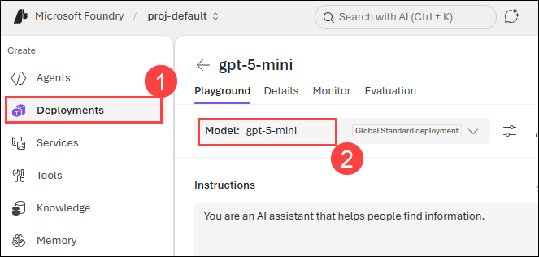
   
1. In the **Chat session** section, enter the following **prompt (1)** and press *Enter*.

    ```code
    Write a function in Python that takes a character and a string as input, and returns how many times that character appears in the string
    ```

1. Observe the **output (2)**. The model will likely respond with a function, with some explanation of what the function does and how to call it.

    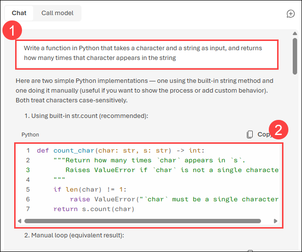

    >**Note** The response may be vary from the image.

1. Next, send the **user prompt (1)**:
   ```
   Do the same thing, but this time write it in C#.
   ```

   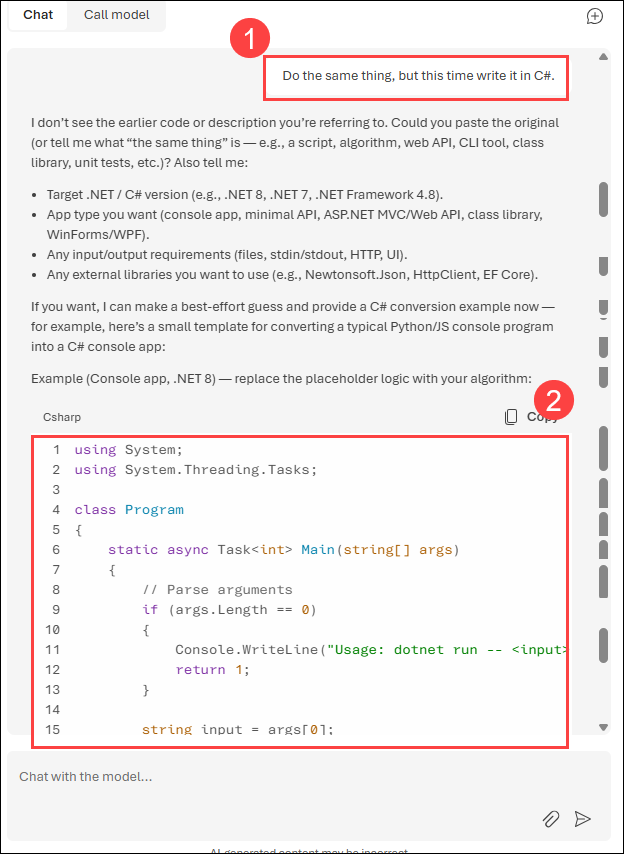

1. Observe the **output (2)** above. The model likely responded very similarly as the first time, but this time coding in C#. You can ask it again for a different language of your choice, or a function to complete a different task, such as reversing the input string.

1. Next, let's explore using AI to understand code with this example of a random function you saw written in Ruby. Send the following prompt as the user query.

    ```code
    What does the following function do?  
    ---  
    def random_func(n)
      start = [0, 1]
      (n - 2).times do
        start << start[-1] + start[-2]
      end
      start.shuffle.each do |num|
        puts num
      end
    end
    ```

1. Observe the **output (2)** above, which explains what the function does.

   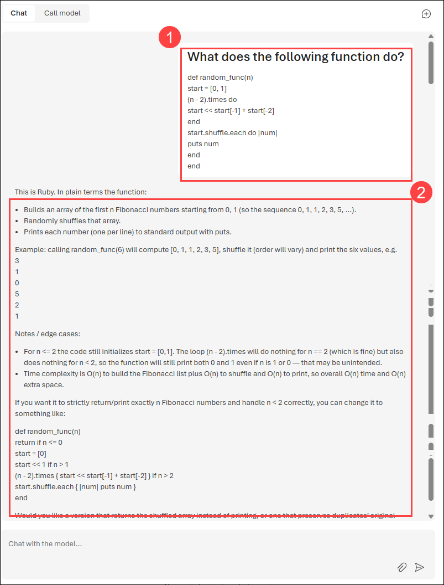

1. Submit the following prompt to get a simpler version of the function.

   ```
   Can you simplify the function?
   ```   

   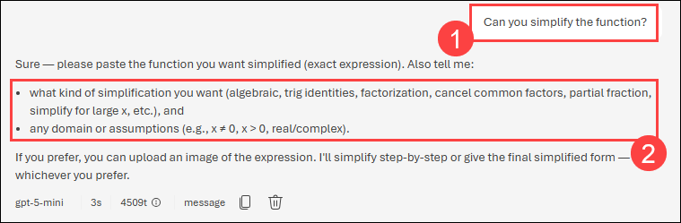

   >**Note**: The model may ask follow-up questions to gather additional information before responding, so that it can give you a more accurate answer.

1. Submit the below-mentioned prompt to add comments to the code.

      ```
      Add some comments to the function for fibonocci code.
      ```

      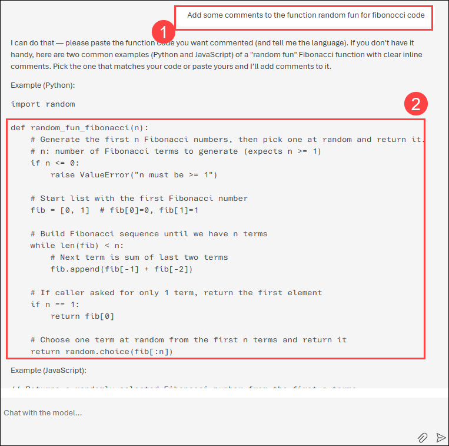     

1. Observe the **user prompt (1)** and **output response (2)**, which includes comments explaining what each part of the function does. 

## Task 2: Set up an application in Cloud Shell

In this task, you will use a short command-line application running in Cloud Shell on Azure to demonstrate how to integrate with a Microsoft Foundry model. Open a new browser tab to access Cloud Shell.

1. In the **Azure portal**, select the **[>_] (Cloud Shell)** button at the top of the page to the right of the search box. A Cloud Shell pane will open at the bottom of the portal.

    

2. If you see the previously opened shell, click on the top right **X** button to close it and open Cloudshell again.

   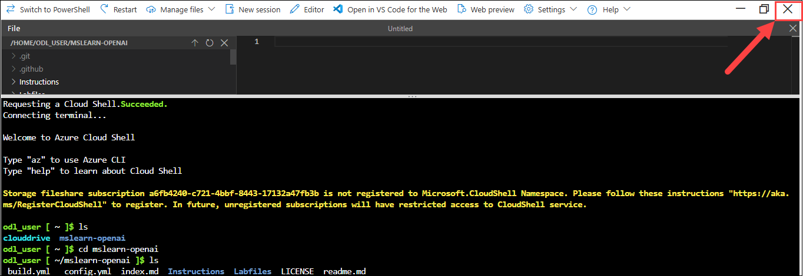

5. The files are downloaded to a folder named **mslearn-openai**. Navigate to the lab files for this task using the following command.

    ```bash
    cd mslearn-openai/Labfiles/04-code-generation-new
    ```

   > **Note:** Applications for both C# and Python have been provided, as well as sample code we'll be using in this lab.

6. Use the following command to open the lab files in the code editor.

    ```bash
    code .
    ```

   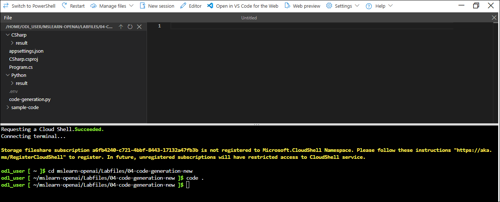

## Task 3: Configure your application

In this task, you will complete key parts of the application to enable it to use your Microsoft Foundry model.

1. In the code editor, expand the language folder for your preferred language.

1. Open the configuration file for your language.

    - **C#:** `appsettings.json`
    - **Python:** `.env`

1. In the configuration file, enter the following values for your Microsoft Foundry service:

    - **Endpoint**: The Azure OpenAI endpoint URL from your Microsoft Foundry in **Home** page.
    - **API**: The API key from your Microsoft Foundry in **Home**.
    - **Deployment Name**: Set this to **my-gpt-model** (the name of your model deployment).
    After updating these values, save the file by right-clicking it in the left pane.

      > **Note:** You can get the Azure OpenAI endpoint and key values from the Microsoft Foundry resource's **Foundry-Lab-<inject key="DeploymentID" enableCopy="false"/>** resource page **Keys and Endpoint** section under **Resource Management**.

        > 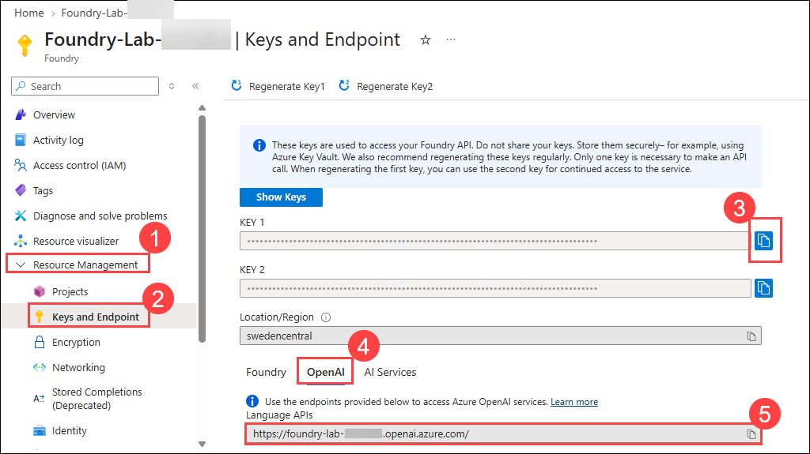

        > **Note**: The Microsoft Foundry portal displays the endpoint as `https://<resource-name>.openai.azure.com/openai/v1/`. Remove the `/openai/v1/` part before saving it, so only the base resource endpoint remains as shown above.

   - **C#:**

      

   - **Python:**

      

1. Navigate to the folder for your preferred language and install the necessary packages. Enter the below-mentioned command to add the `Azure.AI.OpenAI` package to your project, which is necessary for integrating with Azure OpenAI services.

   For **C#:** 

    ```
    cd CSharp
    dotnet add package Azure.AI.OpenAI --version 1.0.0-beta.5
    ```
    
    For **Python:**

      ```bash
    cd Python
    pip install --user openai==1.65.2
    ```

1. Open the application code file of your preferred language and briefly observe the code. 

    - **C#:** `Program.cs`
    - **Python:** `code-generation.py`

## Task 4: Run your application

In this task, you will run your configured app to generate code for each use case, which is numbered in the app and can be executed in any order.

> **Note:** Some users may experience rate limiting if calling the model too frequently. If you hit an error about a token rate limit, wait for a minute then try again.

1. In the code editor, expand the `sample-code` folder and briefly observe the function and the app for your language. The OpenAI tool will use these files to generate the responses. 
   
   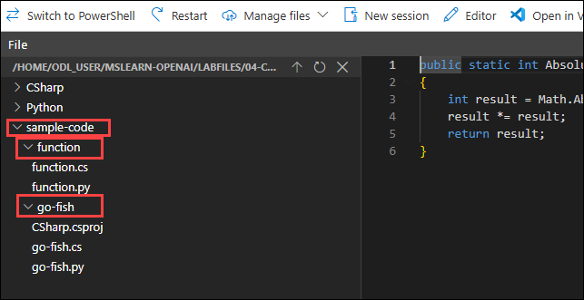

1. In the Cloud Shell bash terminal, navigate to the folder for your preferred language.

1. Run the application.

    - **C#:** `dotnet run`
    - **Python:** `python code-generation.py`

      >**Note:** If you encounter any errors after running the Python script, try upgrading the OpenAI package by running the following command: `pip install --user --upgrade openai`

1. Choose option **1** to add comments to your code. Note, the response might take a few seconds for each of these tasks.

   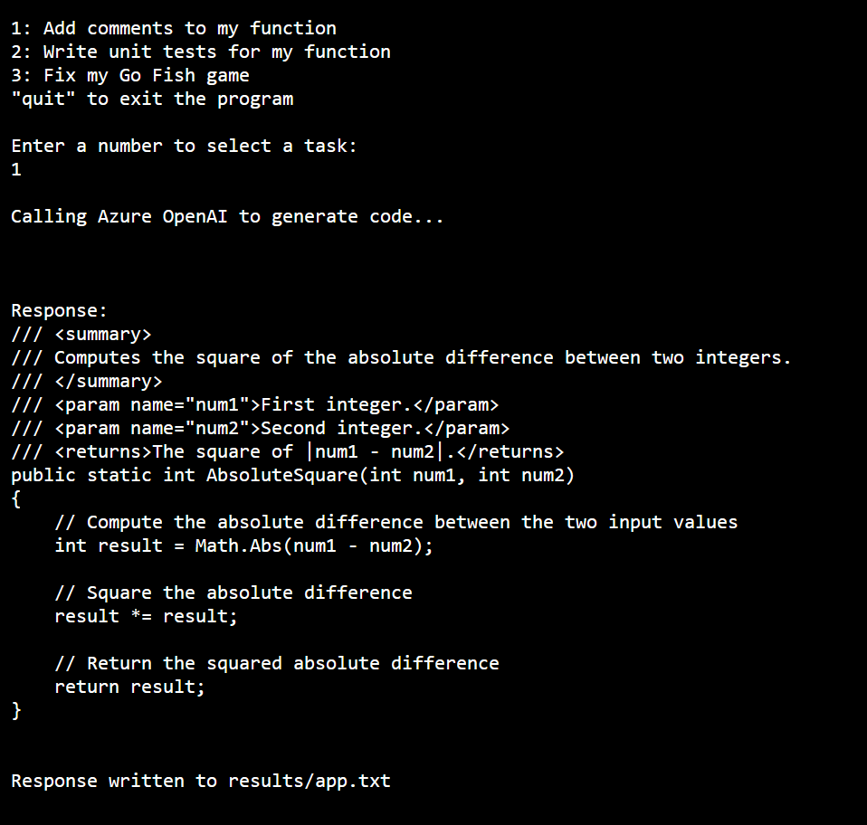

1. In the response, you will see that OpenAI has added comments to your sample code provided from the function file. 

1. Next, choose option **2** to write unit tests for that same function.

   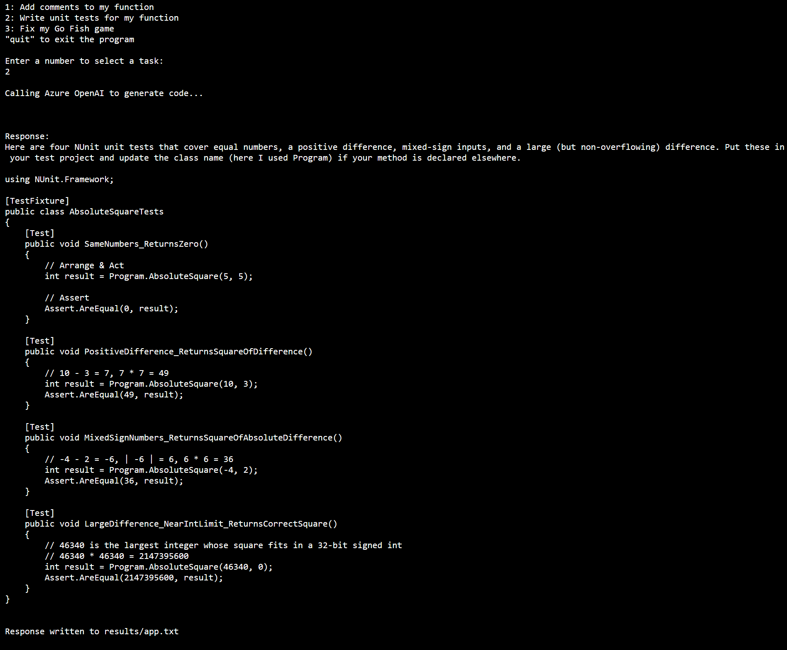

1. In the response, you will notice that the unit tests are added to your sample code.

1. Next, choose option **3** to fix bugs in an app for playing Go Fish. 

   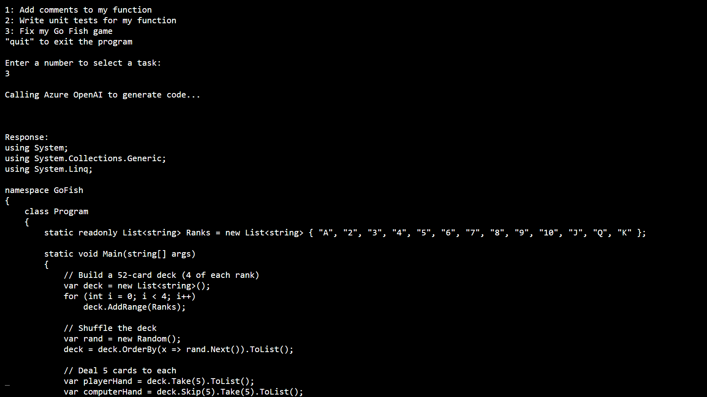

1. This time, OpenAI would use the go fish file and fix the code in it and respond with the updated code. 

1. The results will replace what was in `result/app.txt`, and should have very similar code with a few things corrected.

    - **C#:** Fixes are made on lines 30 and 59
    - **Python:** Fixes are made on lines 18 and 31

        >**Note:** Click on Ctrl+C to stop the project.

10. To check the results, paste the following code in the terminal:

    ```
    cd result
    ```

11. Copy the below command in the terminal to see the contents of the app.txt file.

     ```
     cat app.txt
     ```

      

1. The app for Go Fish in `sample-code` can be run if you replace the lines with bugs with the response from Microsoft Foundry model. If you run it without the fixes, it will not work correctly.

1. It's important to note that even though the code for this Go Fish app was corrected for some syntax, it's not a strictly accurate representation of the game. If you look closely, there are issues with not checking if the deck is empty when drawing cards, not removing pairs from the player's hand when they get a pair, and a few other bugs that require an understanding of card games to realize. This is a great example of how useful generative AI models can be to assist with code generation, but they can't be trusted as correct and need to be verified by the developer.

1. If you would like to see the full response from Microsoft Foundry model, you can set the `printFullResponse` variable to `True` and re-run the app.

## 🧾 Summary

In this lab, you explored how to use Microsoft Foundry to generate, explain, and improve code using natural language prompts. You generated code in different programming languages, explained existing code, and simplified functions using the chat playground. You also set up a command-line application in Cloud Shell, configured it to use your Microsoft Foundry resource, and ran the application to automate code tasks such as adding comments, writing unit tests, and fixing bugs.

### You have successfully completed the lab. Click on **Next >>** to proceed with the next lab.
     
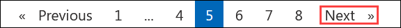
