# Lab 05: Generate images with gpt-image-1.5 model

## Estimated Duration: 75 Minutes

## Lab Scenario

A design team wants concept art drafted straight from written briefs instead of waiting on a stock library, and you are asked to prove that a generative model can do the job. You deploy the gpt-image-1.5 model with custom settings in Microsoft Foundry, then open the image playground and generate a picture from the prompt *An elephant on a skateboard*, before adding style guidance to the same prompt to see how *in the style of Picasso* changes the result. Moving from the portal into code, you open Cloud Shell, configure the sample C# or Python app with your Azure OpenAI endpoint, key, and the `gpt-image-model` deployment name, and review how the app submits a generation request and then polls the **operation-location** callback URL until the image is ready. Finally, you run the app, describe an image such as *A giraffe flying a kite*, and download the generated file to view it.

## Lab Overview

In this lab, you'll use a gpt-image-1.5 model to generate images based on natural language prompts.

The Microsoft Foundry includes an image-generation model named gpt-image-1.5. You can use this model to submit natural language prompts that describe a desired image, and the model will generate an original image based on the description you provide.

## Lab Objectives

In this lab, you will complete the following tasks:

- Task 1: Explore image generation in the gpt-image-1.5 playground
- Task 2: Use the REST API to generate images
    - Task 2.1: Prepare the app environment
    - Task 2.2: Configure your application
    - Task 2.3: View application code
- Task 3: Run the app

## Task 1: Explore image generation in the gpt-image-1.5 playground

In this task, you will use the gpt-image-1.5 playground in the Microsoft Foundry portal to experiment with image generation.

> **Note:** This task relies on the gpt-image-1.5 quota limit available in your Microsoft Foundry the model deployment fails, it may be due to quota restrictions on the existing resource. 

> To resolve this, create a new Microsoft Foundry (as done in **Lab 01**) in a supported region such as **East US 2** or **West US 3**, **Poland Central** and then attempt to deploy the gpt-image-1.5 model again.

> Add this suffix `-1` to the end of Foundry resource name to be unique. 

1. In the **Azure portal**, search for **Foundry (1)** and select **Microsoft Foundry (2)**.

   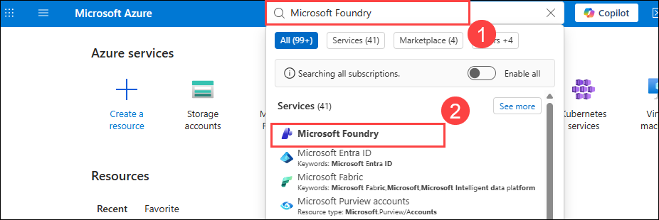

1. On the **Microsoft Foundry | Foundry** page, select **Foundry (1)**, and then choose **Foundry-Lab-<inject key="DeploymentID" enableCopy="false"></inject> (2)**

   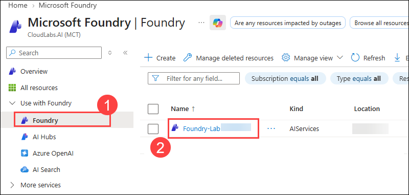


1. In the Microsoft Foundry resource pane, click on **Go to Foundry portal**, which will navigate to **Microsoft Foundry**.

    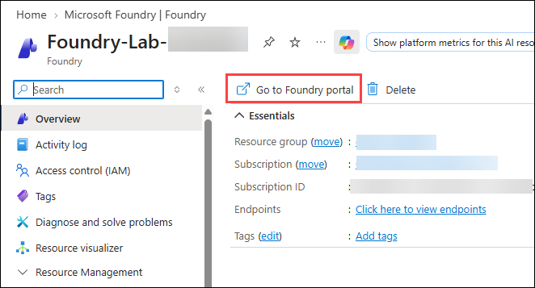

4. On the **Microsoft Foundry** portal, from the top right select **Build (1)** in left navigation pane, select **Deployments (2) or Models**.Under **Deployed models (3)** Then, click **+ Deploy (4)** and choose **Deploy a Base Model (5)** from the drop-down.

      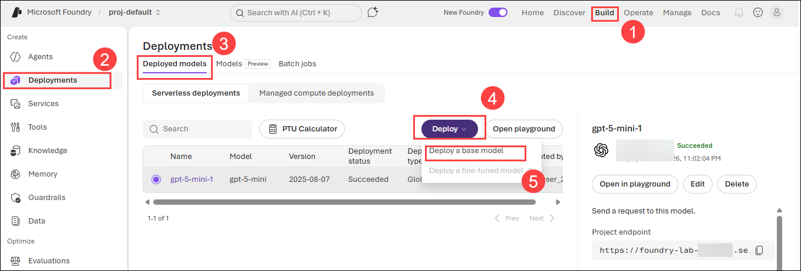

1. It takes you to Discover tab and **Models (1)** in left pane side and Search for **gpt-image-1.5** **(2)** and select the **gpt-image-1.5 (3)**

      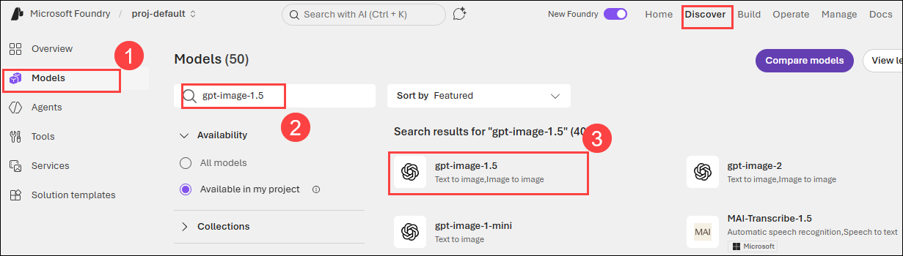

1. In the model page under **Models (1)** click on **Deploy (2)** dropdown to select the **Custom settings (3)**.

      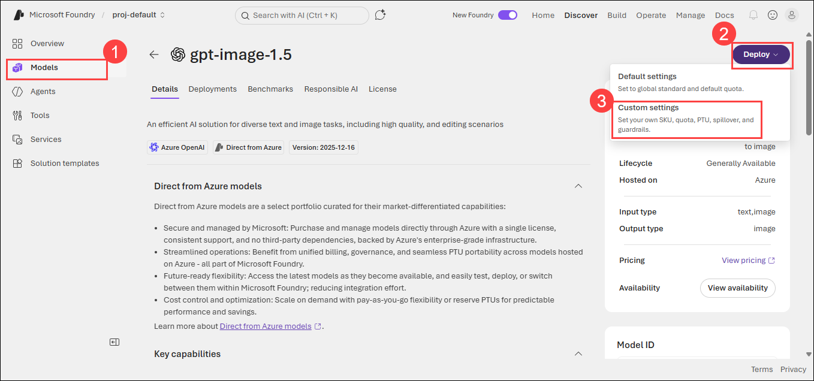

1. It opens the Deploy pop-up to select the custom model values. 
        - Deployment name **(1)**: **gpt-image-model**
        - Deployment type **(2)**: **Global Standard**
        - Request per Minute Rate Limit: **1/9 (4)** (use **slider** to adjust the values)
        - Guadrails: **DefaultV2** **(5)**
      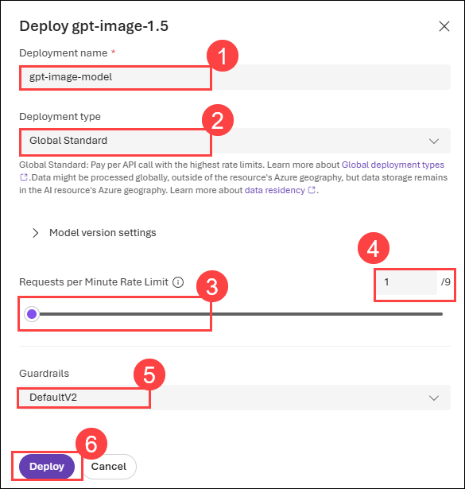

    >**Note:** Make sure that if your model is deployed to a new resource due to quota limitations (as shown in the images below), which is created during deployment, you will need to configure its Azure OpenAI endpoint and API key when using the REST API to generate images, else we can use the one's that we have used before.
      
1. In the left pane, select **Deployments (1)**, then select your **gpt-image-model** deployment. On the model page, make sure the **Playground (2)** tab is selected and confirm that **Model: gpt-image-model (3)** is the selected deployment. The image playground opens with a prompt box at the bottom.


    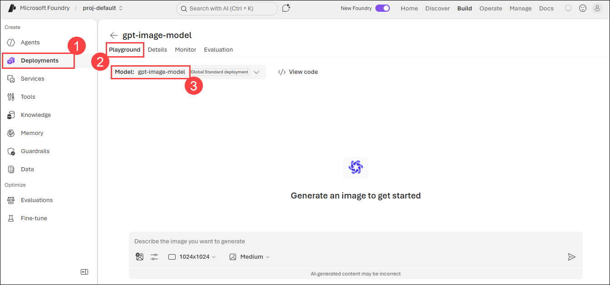

1. In the **Describe the image you want to generate** box, enter the following prompt **(1)**, then select the **send (2)** icon:

    ```
    An elephant on a skateboard
    ```

    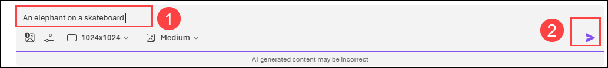

1. The model generates the image and displays it in the playground. Review the result — each image tile shows the prompt used, the model name, and the generation timestamp. Use the download and copy icons on the tile to save the image or copy it for use elsewhere.

     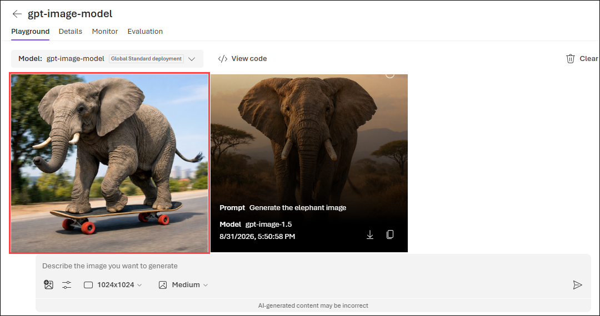

    > **Note:** If you hit any rate limit error please try again after 1 or 2 minutes. 

    > **Note:** The image may appear differently than shown in the screenshot. 

1. Now change the artistic style of the output by adding style guidance to your prompt. Enter the following prompt **(1)** and select the **send (2)** icon:

    ```
    An elephant on a skateboard in the style of Picasso
    ```
1. Compare the new image with the previous one to see how the added style instruction changes the output. To see the API request behind these generations, select **View code (3)**.

    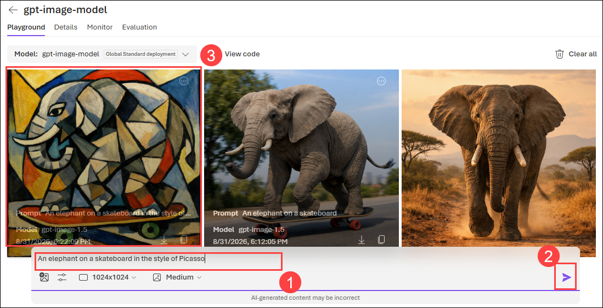

## Task 2: Use the REST API to generate images 

The Azure OpenAI service provides a REST API that you can use to submit prompts for content generation, including images generated by gpt-image-1.5 model.

### Task 2.1: Prepare the app environment

In this task, you will use a simple Python or C# app to generate images by calling the REST API and running the code in the Cloud Shell console interface within the Azure portal.

1. In the **Azure portal**, select the **[>_] (Cloud Shell)** button at the top of the page to the right of the search box. A Cloud Shell pane will open at the bottom of the portal. 

    

    > **Note:** If a **Cloud Shell timed out** pop-up appears, click **Reconnect**.

2. Make sure the type of shell indicated on the top left of the Cloud Shell pane is **Switch to PowerShell**. If it's *Switch to Bash*, select **Switch to Bash** and choose **Confirm** from the pop-up box.

    

4. Navigate to the folder for the language of your preference by running the appropriate command.

    **C#**

    ```bash
    cd mslearn-openai/Labfiles/05-image-generation/CSharp
    ```

    **Python**

    ```bash
    cd mslearn-openai/Labfiles/05-image-generation/Python
    ```

6. Use the following command to open the built-in code editor and see the code files you will be working with.

    ```bash
   code .
    ```
   
### Task 2.2: Configure your application

In this task, you will use a configuration file in the application to store the details needed to connect to your Azure OpenAI service account.

1. In the code editor, select the configuration file for your app, depending on your language preference.

    - C#: `appsettings.json`
    - Python: `.env`
    
2. In the configuration file, enter the following values for your Azure OpenAI service:

    >**Note:** To find the values you need, select the **Home (1)** tab in the top bar of the Microsoft Foundry portal. At the bottom of the page, use the copy icons to copy the **Azure OpenAI endpoint (2)** and the **API key (3)**, and paste them into a notepad.

    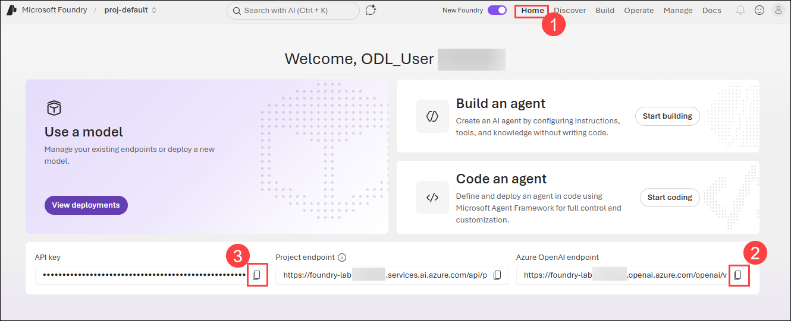

1. Now update the following values in the file:

    - **Endpoint**: The Azure OpenAI endpoint you copied from the portal. Remove the `/openai/v1/` part from the end so that only the base resource URL remains, for example `https://<resource-name>.openai.azure.com/`.
    - **API Key**: The API key you copied from the portal.
    - **Deployment Name**: Set this to **gpt-image-model** (the name of your image generation model deployment).

1. After updating these values, press **CTRL + S** to save the file.

      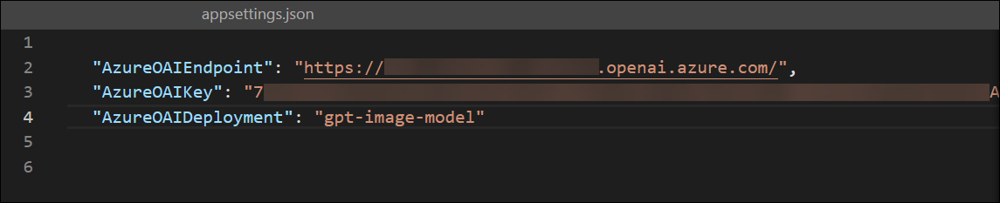

      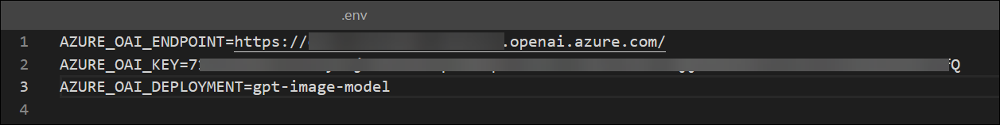

3. If you are using **Python**, you'll also need to install the **python-dotenv** package used to read the configuration file. In the console prompt pane, ensure the current folder is **~/mslearn-openai/Labfiles/05-image-generation/Python**. Then enter this command:

    ```bash
   pip install --user python-dotenv
    ```

1. If you're using **C#**, navigate to `generate_image.csproj`, delete the existing code, then replace it with the following code, and then press **Ctrl+S** to save the file.

    ```
    <Project Sdk="Microsoft.NET.Sdk">

    <PropertyGroup>
    <OutputType>Exe</OutputType>
    <TargetFramework>net9.0</TargetFramework>
    <ImplicitUsings>enable</ImplicitUsings>
    <Nullable>enable</Nullable>
    </PropertyGroup>

     <ItemGroup>
     <PackageReference Include="Azure.AI.OpenAI" Version="1.0.0-beta.14" />
     <PackageReference Include="Microsoft.Extensions.Configuration" Version="8.0.404" />
     <PackageReference Include="Microsoft.Extensions.Configuration.Json" Version="8.0.404" />
     </ItemGroup>

     <ItemGroup>
       <None Update="appsettings.json">
         <CopyToOutputDirectory>PreserveNewest</CopyToOutputDirectory>
        </None>
     </ItemGroup>

    </Project>
    ```    

         

1. Navigate to the folder for your preferred language and install the necessary packages.

    For **C#:**

    ```
    export DOTNET_ROOT=$HOME/.dotnet
    mkdir -p $DOTNET_ROOT
    ```

     >**Note:** Azure Cloud Shell often does not have admin privileges, so you need to install .NET in your home directory. So here you are creating a separate `.dotnet` directory under your home directory to isolate your configuration.
     - `DOTNET_ROOT` specifies where your .NET runtime and SDK are located (in your `$HOME/.dotnet directory`).
     - `mkdir -p $DOTNET_ROOT` This creates the directory where the .NET runtime and SDK will be installed.

1. Run the following command to install the required SDK version locally:     

    ```
    curl -fsSL https://dot.net/v1/dotnet-install.sh -o dotnet-install.sh
    chmod +x dotnet-install.sh
    ``` 

    ```
    ./dotnet-install.sh --channel 8.0 --install-dir $DOTNET_ROOT
    ```

    ```
    export PATH=$DOTNET_ROOT:$PATH
    ```

      >**Note:** These commands download and prepare the official `.NET` installation script, grant it execute permissions, and install the required .NET SDK version (9.0.317) in the `$DOTNET_ROOT` directory, as we don't have the admin privileges to install it globally.

1. Enter the following command to restore the workload.

    ```
    dotnet workload restore
    ```

     >**Note:** Restores any required workloads for your project, such as additional tools or libraries that are part of the .NET SDK.
    
1. Enter the following command to add the `Azure.AI.OpenAI` NuGet package to your project, which is necessary for integrating with Azure OpenAI services.

    ```
    dotnet add package Azure.AI.OpenAI --version 1.0.0-beta.14
    ```

1. For Python, run the following command to install the dependencies

    **Python**

    ```bash
   pip install --user requests
    ```

### Task 2.3: View application code

In this task, you will explore the code used to call the REST API and generate an image.

1. In the code editor pane, select the main code file for your application:

    - C#: `Program.cs`
    - Python: `generate-image.py`

2. Review the code that the file contains, noting the following key features:

    - The code sends HTTPS requests to your Azure OpenAI endpoint, using the service key from the configuration file in the request header.
    - The image generation workflow involves two REST API calls: the first initiates the image generation process, and the second retrieves the results.
    - The initial request includes:
      - The prompt provided by the user describing the desired image
      - The number of images to generate (set to 1)
      - The desired image resolution
    - The response to the initial request contains an **operation-location** header, which provides a callback URL for polling the status of the image generation.
    - The code repeatedly polls the callback URL until the image generation status is *succeeded*, then extracts and displays the URL of the generated image.

## Task 3: Run the app

In this task, you will run the reviewed code to generate some images.

1. In the **Cloudshell** bash terminal, navigate to the folder for your preferred language.

2. In the console prompt pane, enter the appropriate command to run your application:

    **C#**

    ```bash
   dotnet run
    ```

    **Python**

    ```bash
    python generate-image.py
    ```
3. When prompted, enter a description for an image. For example, `A giraffe flying a kite` **(1)**.
    
4. Wait for the image to be generated—you’ll see a success message indicating that the image has been saved. **Copy (2)** the image name, then run the command ``download <image name>`` **(3)**. A **pop-up (4)** will appear at the bottom-right of the Cloud Shell; click it to download and view the generated image. opnfiledwn

    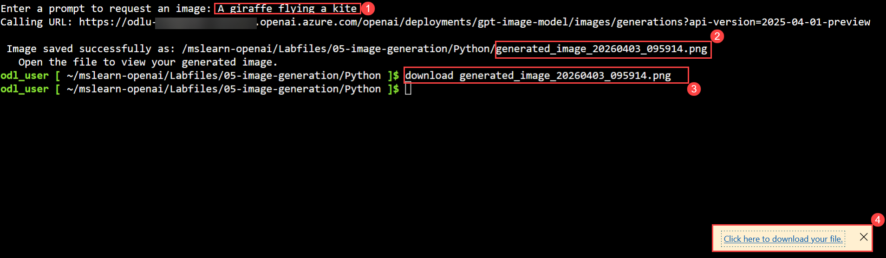

    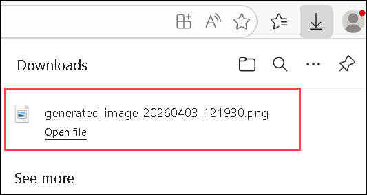

    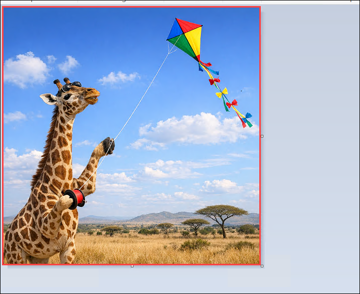

5. Close the tab containing the generated image and re-run the app to generate a new image with a different prompt.

## Summary

In this lab, you explored the gpt-image-1.5 playground in the Azure Microsoft Foundry portal to generate images based on natural language prompts. You also examined a simple application that uses the REST API to generate images with a gpt-image-1.5 model and ran the application in the Cloud Shell console within the Azure portal.

### You have successfully completed the lab. Click on **Next >>** to proceed with the next lab.
     
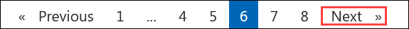
