## Lab 06: Add your data for RAG with Azure OpenAI Service

## Lab scenario
The Azure OpenAI Service enables you to use your own data with the intelligence of the underlying LLM. You can limit the model to only use your data for pertinent topics, or blend it with results from the pre-trained model.

## Lab objectives

In this lab, you will complete the following tasks:

- Task 1: Provision an Azure OpenAI resource
- Task 2: Deploy a model
- Task 3: Observe normal chat behavior without adding your own data
- Task 4: Create an AI Assistant with your own data
- Task 5: Chat with a model grounded in your data
- Task 6: Set up an application in Cloud Shell
- Task 7: Configure your application
- Task 8: Run your application

## Estimated time: 60 minutes

### Task 1: Provision an Azure OpenAI resource

In this task , you'll create an Azure resource in the Azure portal, selecting the OpenAI service and configuring settings such as region and pricing tier. This setup allows you to integrate OpenAI's advanced language models into your applications.

1. In the **Azure portal**, search for **Azure OpenAI (1)** and select **Azure OpenAI (2)** from the results.

   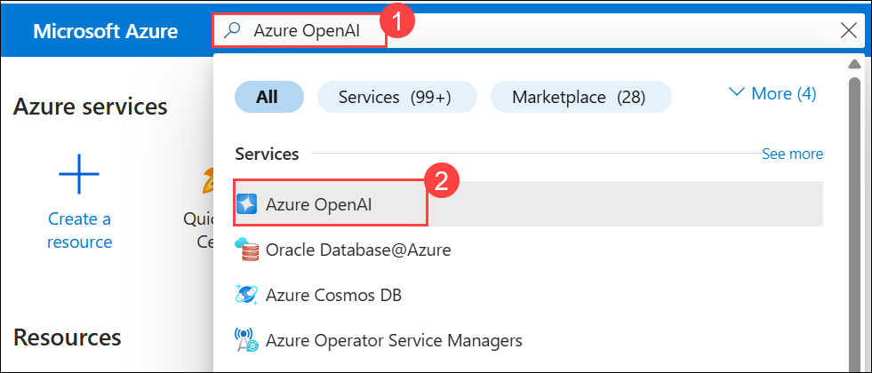

1. On the **Microsoft Foundry | Azure OpenAI** page, Click on **+ Create (1)** from the list, select **Azure OpenAI (2)**

   

1. Create an **Azure OpenAI** resource with the following settings click on **Next (6)** three times and subsequently click on **Create**:
   
    - **Subscription (1**: Default - Pre-assigned subscription.
    - **Resource group (2)**: openai-<inject key="DeploymentID" enableCopy="false"></inject>
    - **Region (3)**: <inject key="Region" enableCopy="false" />
    - **Name (4)**: OpenAI-Lab06-<inject key="DeploymentID" enableCopy="false"></inject>
    - **Pricing tier (5)**: Standard S0

         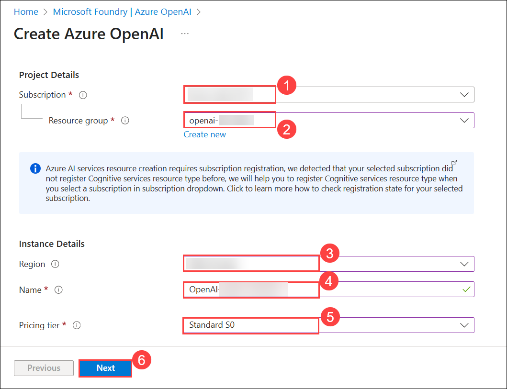

1. Under the **Review + submit** tab, click on **Create**.

      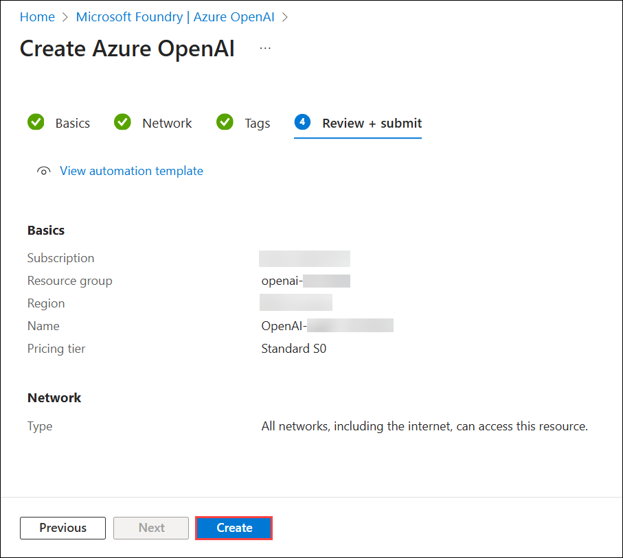

1. Wait for deployment to complete. Click on **Go to resource** to navigate to the deployed Azure OpenAI resource in the Azure portal.

      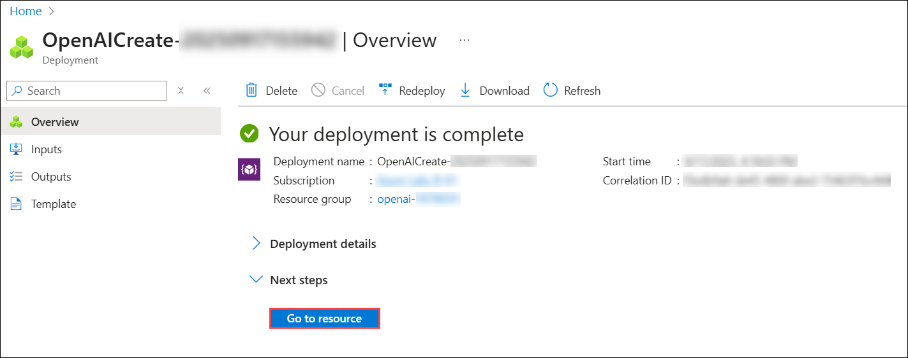

1. To capture the Keys and Endpoints values, on **openai-<inject key="DeploymentID" enableCopy="false"></inject>** blade:
      - Select **Keys and Endpoint (1)** under **Resource Management**.
      - Click on **Show Keys (2)**.
      - Copy **Key 1 (3)** and ensure to paste it in a text editor such as notepad for future reference.
      - Finally copy the **Endpoint (4)** API URL by clicking on copy to clipboard. Paste it in a text editor such as notepad for later use.

        

<validation step="cafb7718-6bf1-4fe9-88b8-d1ed6d7c4c58" />

> **Congratulations** on completing the task! Now, it's time to validate it. Here are the steps:
> - Hit the Validate button for the corresponding task. If you receive a success message, you can proceed to the next task. 
> - If not, carefully read the error message and retry the step, following the instructions in the lab guide.
> - If you need any assistance, please contact us at cloudlabs-support@spektrasystems.com. We are available 24/7 to help you out.

### Task 2: Deploy a model

In this task, you'll deploy a specific AI model instance within your Azure OpenAI resource to integrate advanced language capabilities into your applications.

1. On **Microsoft Foundry | Azure OpenAI** blade, select **OpenAI-Lab06-<inject key="DeploymentID" enableCopy="false"></inject>**

   

1. In the Azure OpenAI resource pane, click on **Go to Foundry portal**. It will navigate to the **Microsoft Foundry portal**.

   

   >**Note:** If the Create a Project pop-up appears, click **Cancel**. Then, on the top-right side, **turn off** the New Foundry toggle. If a feedback pop-up appears, click **Continue without feedback** and then select your **OpenAI Foundry resource**.
   
1. Click on **Deployments (1)** under **Shared 
   Resources**, then select **+ Deploy Model (2)**. Next, choose **Deploy Base Model (3).**

      

1. In the **Select a model** pane, search for **gpt-5-mini (1)**, select the **gpt-5-mini (2)** model, and then select **Confirm (3)**.

    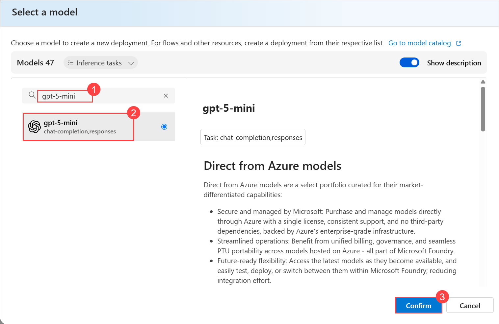

1. In the **Deploy gpt-5-mini** pane, configure the following settings and then select **Deploy (4)**.

    | Setting | Value |
    |----------|-------|
    | **Deployment name (1)** | `text-turbo` |
    | **Deployment type (2)** | **Global Standard** |
    | **Tokens per Minute Rate Limit (3)** | `20K` |
    | **Content filter** | **DefaultV2** |

    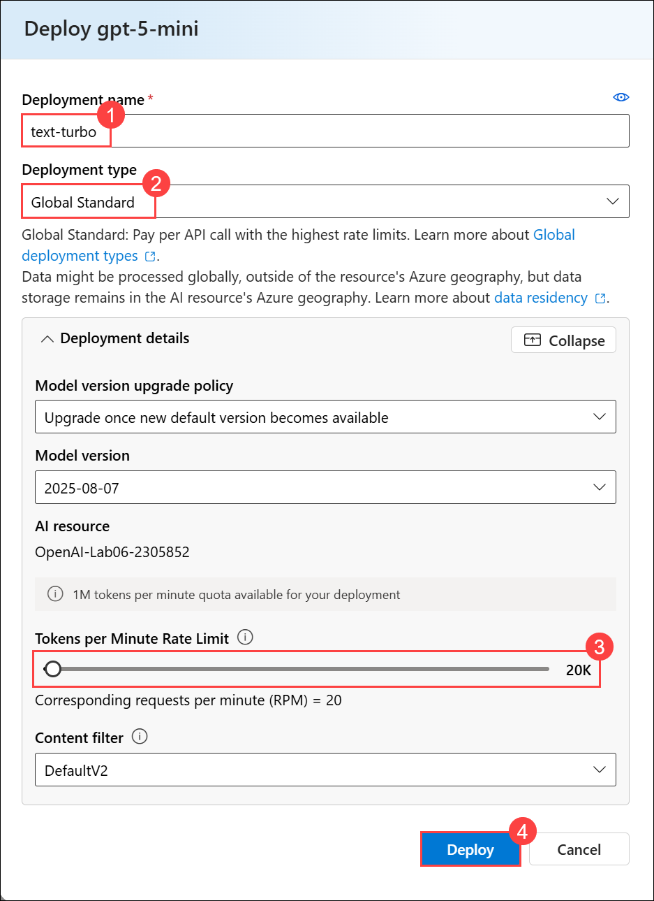

1. Click on the **Create** button to deploy a model which you will be playing around with as you proceed.

<validation step="863492e4-6930-40bf-ab9f-e1ffb7e21a95" />

> **Congratulations** on completing the task! Now, it's time to validate it. Here are the steps:
> - Hit the Validate button for the corresponding task. If you receive a success message, you can proceed to the next task. 
> - If not, carefully read the error message and retry the step, following the instructions in the lab guide.
> - If you need any assistance, please contact us at cloudlabs-support@spektrasystems.com. We are available 24/7 to help you out.

### Task 3: Observe normal chat behavior without adding your own data

Before connecting Azure OpenAI to your data, first observe how the base model responds to queries without any grounding data.

1. In the **Playground** section, select the **Chat** page. The **Chat** playground page consists of three main sections:
     - **Setup** - used to configure settings for the model deployment.
     - **Give the model instructions and context** - used to set the context for the model's responses.
    - **Chat session** - used to submit chat messages and view responses.

      

1. In the **Chat session**, submit the following queries, and review the responses:

    ```
    I'd like to take a trip to New York. Where should I stay?
    ```

    ```
    What are some facts about New York?
    ```

    Try similar questions about tourism and places to stay for other locations that will be included in our grounding data, such as London, or San Francisco. You'll likely get complete responses about areas or neighborhoods, and some general facts about the city.

### Task 4: Connect your data in the chat playground

In this task, you will observe how the base model responds to queries without any grounding data before connecting Azure OpenAI to your data.

1. Copy and paste the following URL into the browser to open the dataset in **GitHub**:

    ```
    https://github.com/CloudLabsAI-Azure/mslearn-openai-data/blob/5d0e51c7c8d42b90612a0c4809bb7582a721acd0/Labfiles/02-use-own-data/data/brochures.zip
    ```

1. Once the **GitHub** page opens, click the **Download** button as shown in the image below to download the **brochures.zip** dataset to your **Lab VM**.

   

1. In **File Explorer**, navigate to **Downloads (1)**, right-click the **brochures (2)** compressed folder that you downloaded earlier, and select **Extract All… (3)**.

   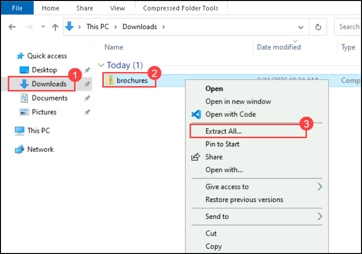

1. In the **Extract Compressed (Zipped) Folders** window, keep the default extraction location and click **Extract (4)** to extract the files.

   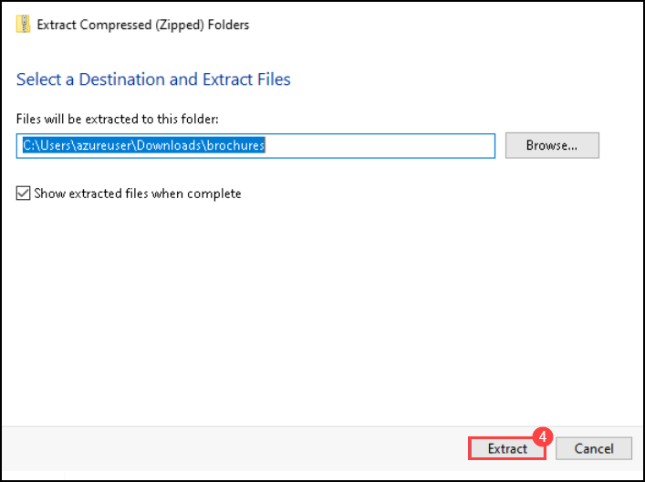
   

1. Navigate back to Foundry and from the left navigation pane click on **Assistants (1)**, under Deployment select your model **text-turbo (2)** and then click on **+ Create an assistant (3)**.    

    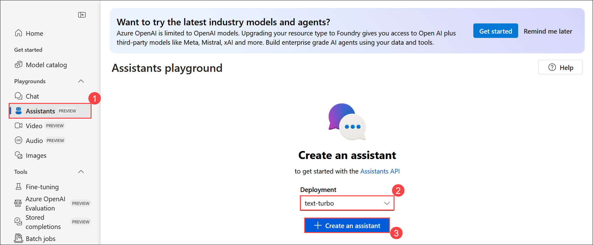

1. Enter Assistant name as ``text-turbo-assistant`` **(1)** and ensure **text-turbo (2)** is selected under Deployments. Under **Tools** section enable **File Search (3)** and click on **+ Add Vector store (4)**

    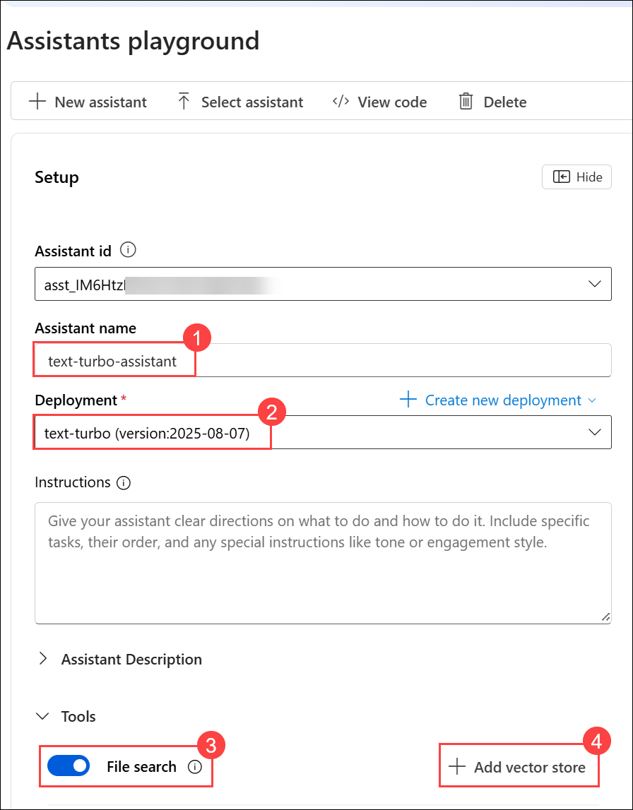

1. On the **Attach files to the assistant file search** click on **Select local files**.

    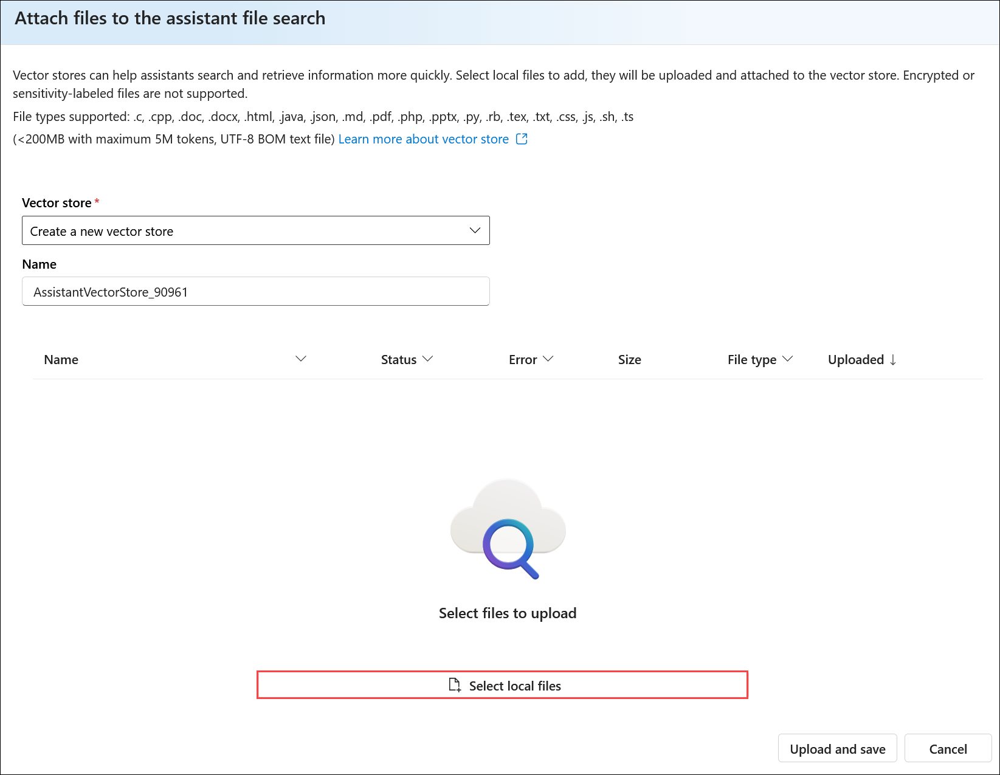

1. In the **Open** window, navigate to the extracted **data** folder **(1)**. Select all the brochure PDF files **(2)** and then click **Open (3)** to upload them.

    

1. Now your Vector store will appear under **Files search (1)** section and also copy the **Assistant id (2)** and save in a notepad for later use.

    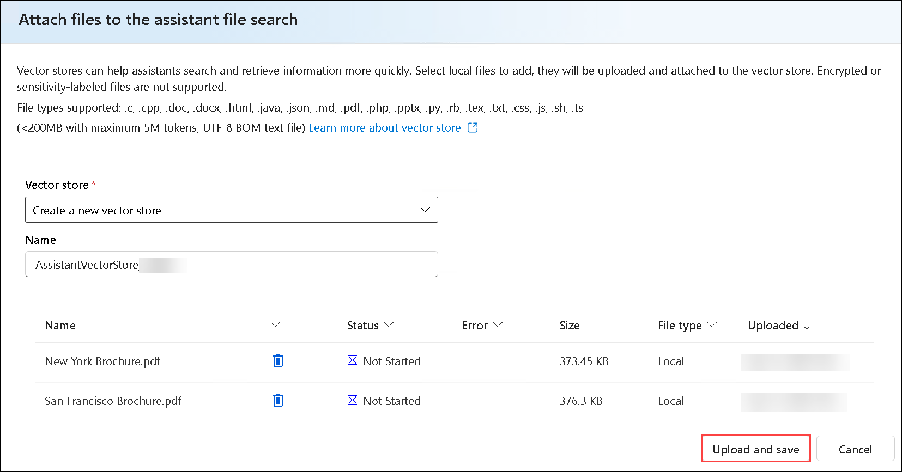


## Task 5: Chat with a model grounded in your data

In this task, you will ask the same questions as before in the chat section after adding your data, and observe how the responses differ.

1. In the **Chat** session on the right side, submit the following queries, and review the responses:

   ```
   I'd like to take a trip to New York. Where should I stay?
   ```

   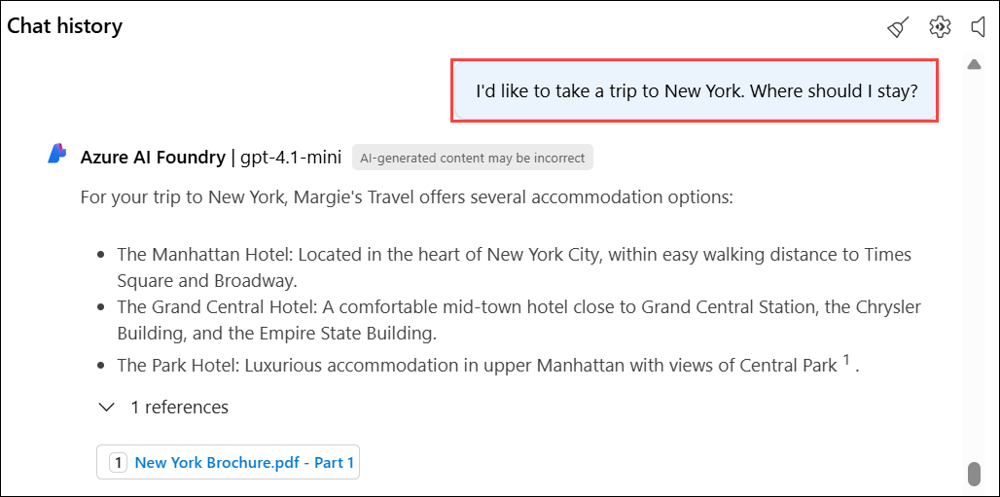

   ```
   What are some facts about New York?
   ```

   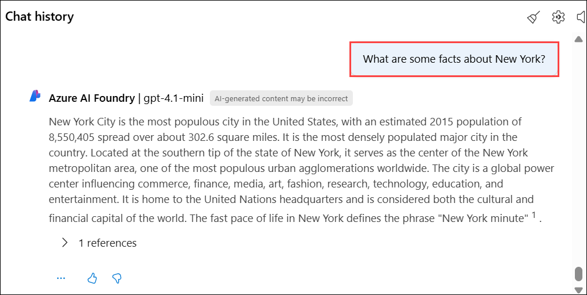

1. You'll notice a very different response this time, with specifics about certain hotels and a mention of Margie's Travel, as well as references to where the information provided came from. If you open the PDF reference listed in the response, you'll see the same hotels as the model provided. Try asking it about other cities included in the grounding data, which are Dubai, Las Vegas, London, and San Francisco.

    >**Note:** **Add your data** is still in preview and might not always behave as expected for this feature, such as giving the incorrect reference for a city not included in the grounding data.

## Task 6: Set up an application in Cloud Shell

In this task, you will use a short command-line application running in Cloud Shell on Azure to demonstrate integration with an Azure OpenAI model. Open a new browser tab to access Cloud Shell.

1. In the [Azure portal](https://portal.azure.com?azure-portal=true), select the **[>_] (Cloud Shell)** button at the top of the page to the right of the search box. A Cloud Shell pane will open at the bottom of the portal.

    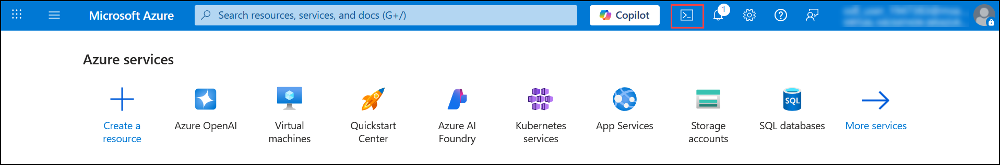

    >**Note:** If you can't find Cloud Shell, click on the **ellipsis (...) (1)** and then select **Cloud Shell (2)** from the menu.

    1.png)

1. The first time you open the Cloud Shell, you may be prompted to choose the type of shell you want to use (*Bash* or *PowerShell*). Select **Bash**. If you don't see this option, skip the step.

     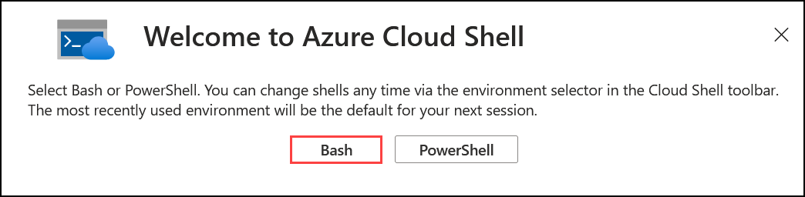

1. Within the **Getting started** page, select **Mount storage account (1)**, select your **Subscription (2)** from the dropdown and click **Apply (3)**.

     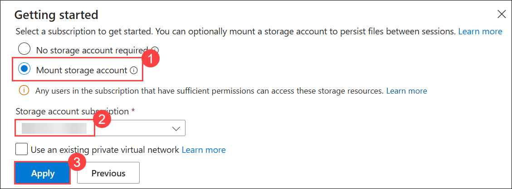

1. Within the **Mount storage account** page, select **I want to create a storage account (1)** and click **Next (2)**.

    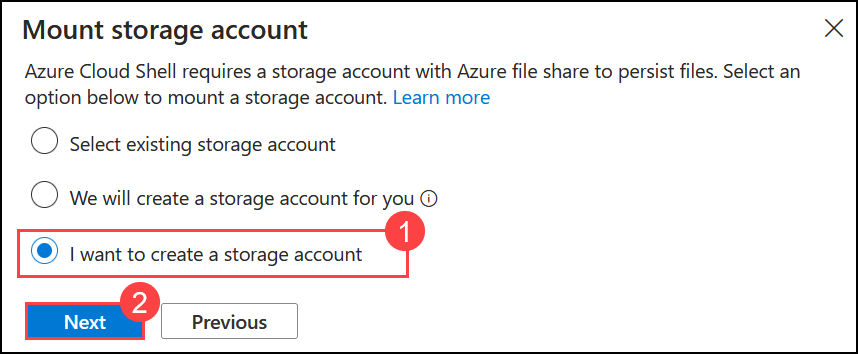

1. Within the **Create storage account** page, enter the following details:

    - **Subscription:** Default - Pre-assigned subscription **(1)**.
    - **Resource group:** **openai-<inject key="DeploymentID" enableCopy="false"></inject> (2)**
    - **Region:** Select **<inject key="Region" enableCopy="false" /> (3)**
    - **Storage account name:** **stg<inject key="DeploymentID" enableCopy="false"></inject> (4)**
    - **File share:** none **(5)**
    - Click **Create (6)**

      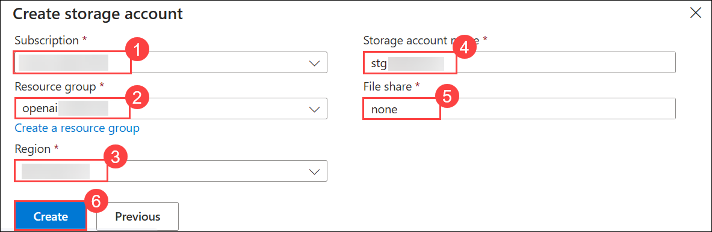

1. Once the terminal opens, click on **Settings (1)** and select **Go to Classic version (2)**.

   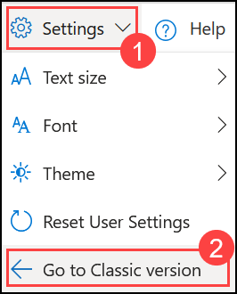
4. In the cloud shell pane, enter the following commands to clone the GitHub repo containing the code files for this exercise.

     ```
     rm -r mslearn-openai -f
     git clone https://github.com/microsoftlearning/mslearn-openai mslearn-openai
     ```

5. After the repo has been cloned, navigate to the folder containing the chat application code files.
   
    ```bash
    cd mslearn-openai/Labfiles/02-use-own-data
    ```

    Applications for both C# and Python have been provided, as well as sample code we'll be using in this lab.

5. Open the built-in code editor, and you can observe the code files we'll be using in `sample-code`. Use the following command to open the lab files in the code editor.

    ```bash
   code .
    ```

## Task 7: Configure your application

In this task, you will complete key parts of the application to enable it to use your Azure OpenAI resource.

1. In the code editor, expand the language folder for your preferred language.

1. Open the configuration file for your language and update the code.

    - **C#**: `appsettings.json`

        ```json
        {
        "AzureOAIEndpoint": "Your OpenAI endpoint",
        "AzureOAIKey": "Azure OpenAI Key",
        "AssistantId": "Id of your Assistant"
        }
        ```

    - **Python**: `.env`

        ```
        AZURE_OAI_ENDPOINT=<Your OpenAI endpoint>
        AZURE_OAI_KEY=<Azure OpenAI Key>
        ASSISTANT_ID=<Id of your Assistant>
        ```

1. Update the configuration file for your chosen language with the following values:

    - **Azure OpenAI endpoint**: Paste the endpoint URL from your Azure OpenAI resource (found on the Keys and Endpoint page in the Azure portal).
    - **Azure OpenAI key**: Paste the key from your Azure OpenAI resource (also on the Keys and Endpoint page).
    - **AssistantId**: Enter the ID of your assistant that you created in Task 2.
    - Save your changes after updating these values.

        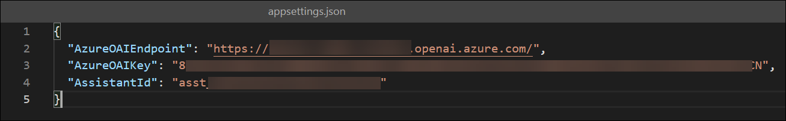

        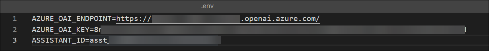

1. If you're using **C#**, navigate to `CSharp.csproj`, delete the existing code, then replace it with the following code, and then press **Ctrl+S** to save the file.

    ```
    <Project Sdk="Microsoft.NET.Sdk">

    <PropertyGroup>
        <OutputType>Exe</OutputType>
        <TargetFramework>net8.0</TargetFramework>
        <ImplicitUsings>enable</ImplicitUsings>
        <Nullable>enable</Nullable>
        <LangVersion>12</LangVersion>
    </PropertyGroup>

    <ItemGroup>
        <PackageReference Include="Azure.AI.OpenAI" Version="2.1.0" />
        <PackageReference Include="Azure.Search.Documents" Version="11.6.0" />
        <PackageReference Include="Microsoft.Extensions.Configuration" Version="8.0.0" />
        <PackageReference Include="Microsoft.Extensions.Configuration.Json" Version="8.0.0" />
        <PackageReference Include="Newtonsoft.Json" Version="13.0.3" />
    </ItemGroup>

    <ItemGroup>
        <None Update="appsettings.json">
        <CopyToOutputDirectory>PreserveNewest</CopyToOutputDirectory>
        </None>
    </ItemGroup>

    </Project>
    ```    

         

1. Navigate to the **CSharp** folder and install the necessary packages. These commands set up the environment for a local installation of the .NET SDK in Cloud Shell.

   For **C#:**

    ```
    cd CSharp
    ```

    ```
    export DOTNET_ROOT=$HOME/.dotnet
    mkdir -p $DOTNET_ROOT
    ```

     >**Note:** Azure Cloud Shell often does not have admin privileges, so you need to install .NET in your home directory. So here you are creating a separate `.dotnet` directory under your home directory to isolate your configuration.
     - `DOTNET_ROOT` specifies where your .NET runtime and SDK are located (in your `$HOME/.dotnet directory`).
     - `mkdir -p $DOTNET_ROOT` This creates the directory where the .NET runtime and SDK will be installed.

1. Run the following command to install the required SDK version locally:     

    ```
    curl -fsSL https://dot.net/v1/dotnet-install.sh -o dotnet-install.sh
    chmod +x dotnet-install.sh
    ``` 

    ```
    ./dotnet-install.sh --channel 8.0 --install-dir $DOTNET_ROOT
    ```

    ```
    export PATH=$DOTNET_ROOT:$PATH
    ```

1. Enter the following command to restore any required workloads for your project, such as additional tools or libraries that are part of the .NET SDK.

    ```
    dotnet workload restore
    ```

1. Enter the following command to add the `Azure.AI.OpenAI` NuGet package to your project, which is necessary for integrating with Azure OpenAI services.

    ```
    dotnet add package Azure.AI.OpenAI --version 2.1.0
    dotnet add package Azure.Search.Documents --version 11.6.0
    ```

    ```
    dotnet add package Azure.AI.OpenAI --prerelease
    dotnet add package OpenAI --prerelease
    ```

1. If you prefer **Python**, navigate to the **Python** folder and install the necessary packages using the commands below:

    ```
    cd Python
    python -m venv labenv
    ./labenv/bin/Activate.ps1
    pip install --user python-dotenv openai==1.65.2
    ```

1. In the code editor, replace your entire file code.

    For **C#**: OwnData.cs

    ```csharp
    using System.ClientModel;
    using Microsoft.Extensions.Configuration;

    using Azure.AI.OpenAI;
    using OpenAI.Assistants;
    using OpenAI;

    #pragma warning disable OPENAI001

    // Get configuration settings  
    IConfiguration config = new ConfigurationBuilder()
        .AddJsonFile("appsettings.json")
        .Build();

    string oaiEndpoint = config["AzureOAIEndpoint"] ?? "";
    string oaiKey = config["AzureOAIKey"] ?? "";
    string assistantId = config["AssistantId"] ?? "";

    // Initialize client
    AzureOpenAIClient azureClient = new(new Uri(oaiEndpoint), new ApiKeyCredential(oaiKey));
    AssistantClient assistantClient = azureClient.GetAssistantClient();

    // Get input
    Console.WriteLine("Enter a question:");
    string text = Console.ReadLine() ?? "";

    // Create thread
    var thread = assistantClient.CreateThread().Value;

    // Add message
    assistantClient.CreateMessage(
        thread.Id,
        MessageRole.User,
        new[] { MessageContent.FromText(text) }
    );

    // Run assistant (UPDATED)
    var run = assistantClient.CreateRun(thread.Id, assistantId).Value;

    // Wait for completion
    while (run.Status == RunStatus.Queued || run.Status == RunStatus.InProgress)
    {
        Thread.Sleep(1000);
        run = assistantClient.GetRun(thread.Id, run.Id).Value;
    }

    // Get messages
    var messages = assistantClient.GetMessages(thread.Id);

    // Print response
    foreach (var msg in messages)
    {
        if (msg.Role == MessageRole.Assistant)
        {
            Console.WriteLine(msg.Content[0].Text);
        }
    }
    ```

    For **Python**: ownData.py

    ```python
    import os
    from openai import AzureOpenAI
    import dotenv
    import time

    dotenv.load_dotenv()

    endpoint = os.environ.get("AZURE_OAI_ENDPOINT")
    api_key = os.environ.get("AZURE_OAI_KEY")
    assistant_id = os.environ.get("ASSISTANT_ID")

    client = AzureOpenAI(
        azure_endpoint=endpoint,
        api_key=api_key,
        api_version="2024-05-01-preview"
    )

    # Get user input
    text = input('\nEnter a question:\n')

    # Create thread
    thread = client.beta.threads.create()

    # Add message
    client.beta.threads.messages.create(
        thread_id=thread.id,
        role="user",
        content=text
    )

    # Run assistant
    run = client.beta.threads.runs.create(
        thread_id=thread.id,
        assistant_id=assistant_id
    )

    # Wait for completion
    while run.status in ["queued", "in_progress"]:
        time.sleep(1)
        run = client.beta.threads.runs.retrieve(
            thread_id=thread.id,
            run_id=run.id
        )

    # Get messages
    messages = client.beta.threads.messages.list(thread_id=thread.id)

    # Print response
    for msg in messages.data:
        if msg.role == "assistant":
            print("\nAssistant:", msg.content[0].text.value)
    ```


1. Save the changes to the code file.

## Task 8: Run your application

In this task, you will run your configured app to send a request to your model and observe the response, noting that the only difference between options is the prompt content while all other parameters (such as token count and temperature) remain consistent.

In this task, you will run the reviewed code to generate some images.

1. In the **Cloudshell** bash terminal, navigate to the folder for your preferred language.

2. In the interactive terminal pane, ensure the folder context is the folder for your preferred language. Then enter the following command to run the application.

    - **C#**: `dotnet run`
    - **Python**: `python ownData.py`

        >**Note**: If you encounter any errors after running the Python script, try upgrading the OpenAI package by running the following command:
        
        ```
        pip install --user --upgrade openai
        ```

3. Review the response to the prompt `Tell me about London`, which should include an answer as well as some details of the data used to ground the prompt, which was obtained from your search service.

    

## Summary

In this lab, you have accomplished the following:
-   Provisioned an Azure OpenAI resource
-   Deployed an OpenAI model within the Microsoft Foundry portal
-   Used the power of OpenAI models to generate responses limited to a custom ingested data.

### You have successfully completed the lab.
