# Lab 06: Add your data for RAG with a Microsoft Foundry Agent

## Estimated Duration: 75 Minutes

## 📘 Scenario

A travel company wants its assistant to answer from the brochures it publishes rather than from whatever the model picked up during training, and you are asked to build that grounding. You start in the Playground by asking where to stay in New York and what facts the model knows about the city, establishing how the ungrounded model responds. You then create an agent named `my-gpt-agent` in Microsoft Foundry, turn off web search so it can only draw on your documents, and upload the lab's city brochure PDFs into a new vector index, saving the configuration as a new agent version. Asking the same two questions again, you get specific hotels along with inline citations pointing back to the source PDFs. Finally, you set up the sample application in Cloud Shell, configure it with your Microsoft Foundry endpoint, key, and agent details, and run it to ask `Tell me about London` from code.

## 📖 Overview

In this lab, you will learn how to connect your own data to the Microsoft Foundry Agent for Retrieval-Augmented Generation (RAG).

The Microsoft Foundry enables you to use your own data with the intelligence of the underlying LLM. You can limit the model to only use your data for pertinent topics or blend it with results from the pre-trained model.

## 🎯 Objectives

In this lab, you will complete the following tasks:

- Task 1: Observe normal chat behavior without adding your own data
- Task 2: Create an Agent and connect your data
- Task 3: Chat with a model grounded in your data
- Task 4: Set up an application in Cloud Shell
- Task 5: Configure your application
- Task 6: Run your application

## Task 1: Observe normal chat behavior without adding your own data

In this task, you will observe how the base model responds to queries without any grounding data.

1. In the Microsoft Foundry portal, select the **Build (1)** tab in the top bar, then select **Deployments (2)** or **Models**, depending on your portal experience. Under **Deployed models (3)**, select your deployed model by clicking on the model name **(4)** `gpt-5-mini`.

    

1. You are taken to the model page under the **Deployments** or **Models** **(1)** tab in the left pane. Make sure the correct **model deployment (3)** is selected under the **Playground (2)** tab. In the **Instructions (4)** box, you can provide a system message that tells the model how to behave in response to the prompts you send.

    

1. The playground lets you experiment with the model and test its capabilities. Leave the existing system message in the **Instructions** box as it is.

    - Existing system message: `You are an AI assistant that helps people find information`

1. In the **Chat** panel on the right side, submit the following queries, and review the **User query (1)** and **responses (2)**:

    ```
    I'd like to take a trip to New York. Where should I stay?
    ```

    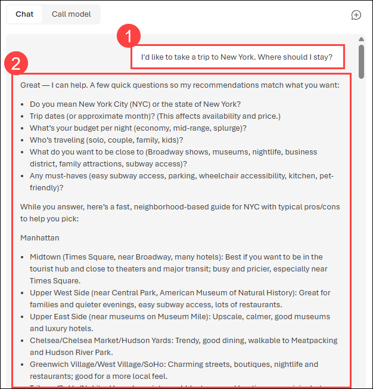

    ```
    What are some facts about New York?
    ```

    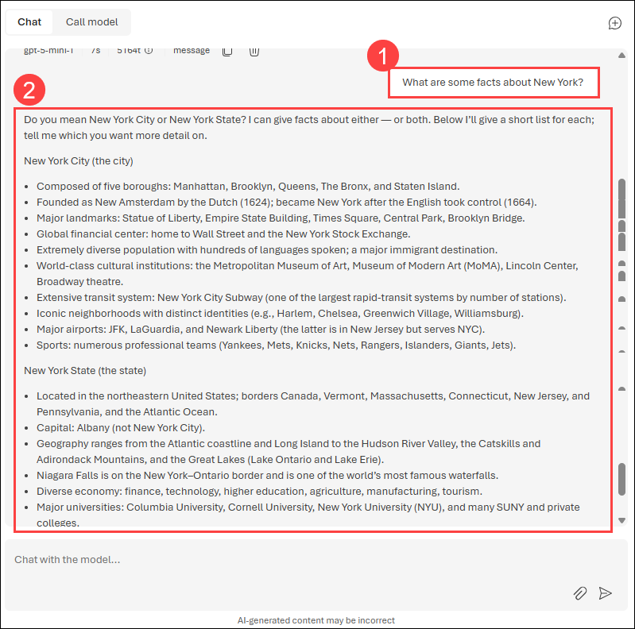

    Try similar questions about tourism and places to stay for other locations that will be included in our grounding data, such as London or San Francisco. You'll likely get complete responses about areas or neighbourhoods, and some general facts about the city.

## Task 2: Create an Agent and connect your data

In this task, you will create an agent that responds to queries with grounding data.

1. From the **Build** tab, select **Agents (1)** to open the Agents page. On the **Agents (2)** tab, click the **New agent (3)** dropdown and choose **Build an agent (4)** to create a new agent in Foundry.

    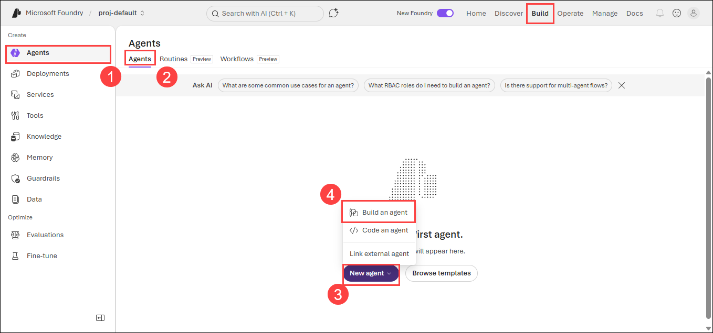

1. In the **Create an agent** pop-up, enter `my-gpt-agent` **(1)** as the Agent name, then select **Create and open playground (2)** to create the agent.

    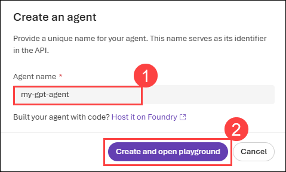

1. On the **Agents (1)** tab in the left pane, select the agent you created, `my-gpt-agent` **(2)**. On its **Playground (3)** tab, click the model dropdown **(4)** and confirm the correct model (`my-gpt-model` or `gpt-5-mini`) under Deployments is selected.

    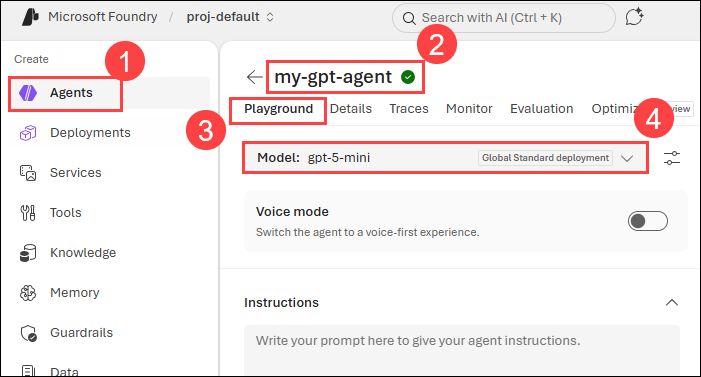

1. Since the agent should answer from your uploaded documents rather than the internet, disable web search. In the **Tools (1)** section, click the **Add (2)** dropdown and switch the **Web search (3)** toggle to **off**. This removes the tool from the agent's tool list.

    > Alternatively, locate **Web search** in the tools list, click the ellipsis (**⋮**) next to it, and select **Delete**.
    >
    > **Note:** **Web search** uses Grounding with Bing, which has additional costs and terms. Customer data flows outside the Azure compliance boundary when this tool is enabled.

    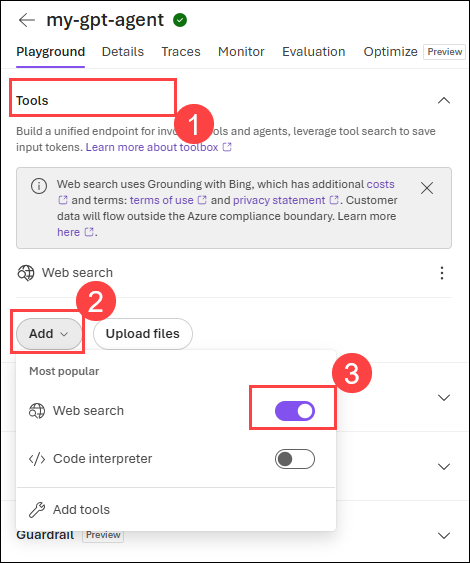

1. Next, click **Upload files**, located beside the **Add** dropdown in the **Tools** section. This lets you add files from your local machine for the agent to reference.

    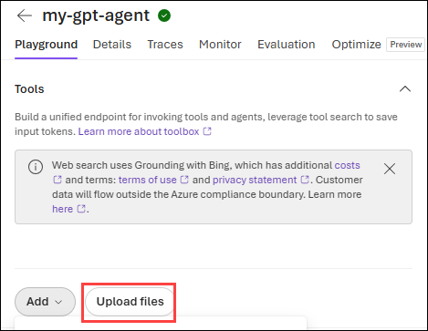

1. In the **Attach files** pop-up, leave **Index option (1)** set to **Create a new index**. A **Vector index name (2)** is generated automatically — for example, `index_green_bear_drhrz2jl9r`. The name in your environment will differ from the one shown here; leave it as is.

1. Then click **browse for files (3)** to select documents from your local machine, or drag and drop them into the upload area.

    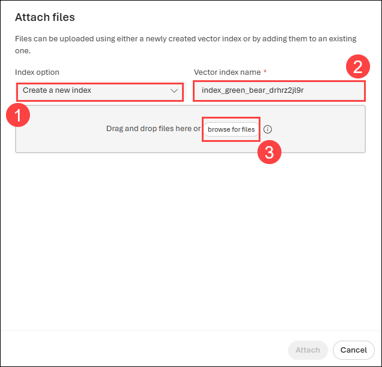

    > **Note:** **The vector index** is what allows the agent to answer from your documents. When you attach files, Foundry splits them into chunks, converts each chunk into a numeric vector using a text embedding model, and stores those vectors in the index. At query time, your question is embedded the same way and the closest matching chunks are retrieved and passed to the model as grounding context so answers come from your documents rather than the public web.
    >
    > **A text embedding model** deployment is created automatically as part of this process, so you don't need to deploy one separately.

1. Now navigate to `C:\AllFiles\mslearn-openai-main\Labfiles\06-use-own-data\data` **(1)**. Select all the **PDF files (2)** and click on **Open (3)**.

    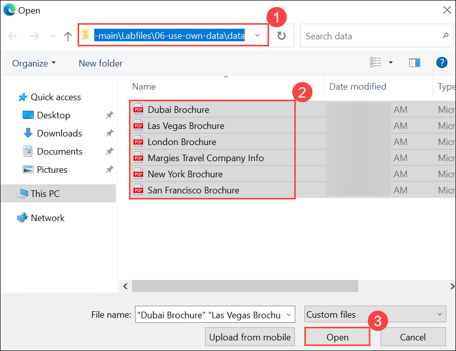

1. Verify that the selected files **(1)** are listed, then click **Attach (2)** to upload them to the vector index.

    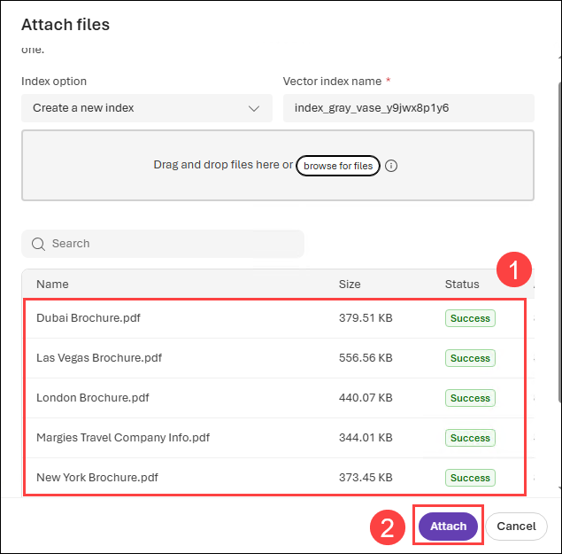

1. Once the upload completes, a **File search** tool appears in the **Tools** section, listing your vector index along with its size and vector store ID — for example, `index_gray_vase_y9jwx8p1y6`. The index name in your environment will differ from the one shown here.

    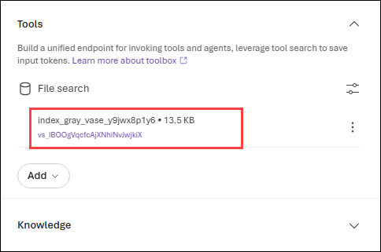

1. Once the tools are configured, click **Save (1)** in the top-right corner to save your changes. Note the **Version (2)** indicator beside it, which currently shows **Version 1**.

    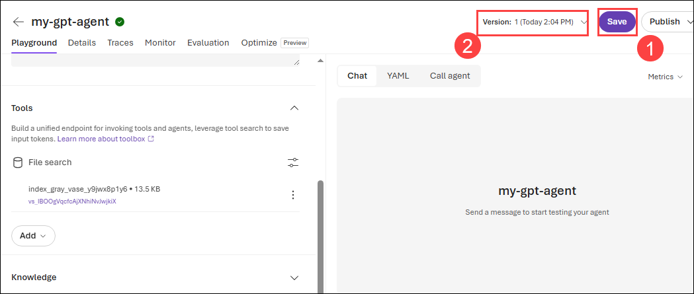

1. After saving, the version increments — for example, from **Version 1** to **Version 2** — and the **Save** button becomes greyed out, confirming there are no unsaved changes.

    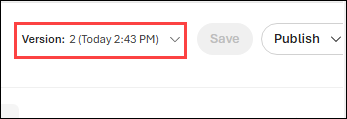

1. Click the **Version (1)** dropdown to review your agent's version history. The most recent version is marked **Active (2)**, and earlier versions remain listed. From here you can also **Compare versions**, **Show all version history**, or **Delete current version**.

    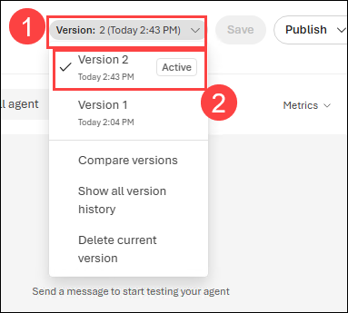

    > **Note:** Foundry creates a new version each time you save changes to the agent, so you can track configuration changes and roll back if needed. The timestamps in your environment will differ from those shown in the screenshots.

## Task 3: Chat with a model grounded in your data

In this task, you will ask the same questions as before in the chat section after adding your data, and observe how the responses differ.

1. In the **Chat** panel on the right, test the agent by entering the following prompt in the **Message the agent...** box below and pressing **Enter**.

    ```
    I'd like to take a trip to New York. Where should I stay?
    ```

1. The agent generates a response **(2)** using the content from your uploaded document rather than the web. Each fact includes an inline reference number, and the source files are listed as citations **(3)** below the response — for example, `New York Brochure.pdf`. Click a citation to view the exact passage the answer was drawn from.

    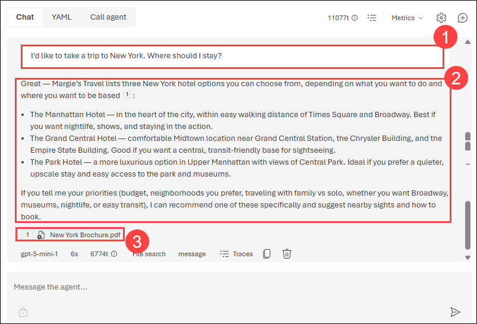

1. Now submit the second query and review the response:

    ```
    What are some facts about New York?
    ```

    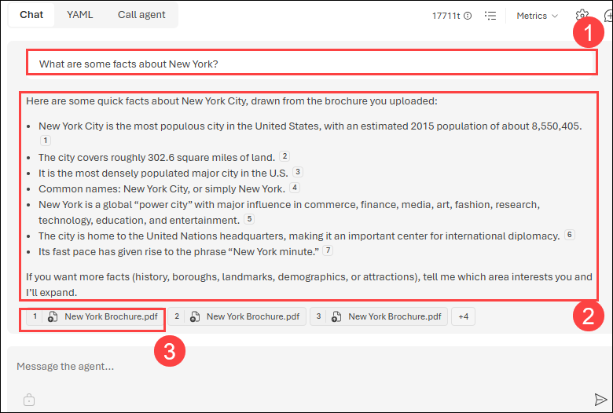

1. You'll notice a very different response this time, with specifics about certain hotels, as well as references to where the information provided came from. If you open the PDF reference listed in the response, you'll see the same hotels as the model provided. Try asking it about other cities included in the grounding data, which are Dubai, Las Vegas, London, and San Francisco.

    > **Note:** This feature is still in preview and might not always behave as expected, such as giving an incorrect reference for a city not included in the grounding data.

## Task 4: Set up an application in Cloud Shell

In this task, you will use a short command-line application running in Cloud Shell on Azure to demonstrate integration with a Microsoft Foundry model. Open a new browser tab to access Cloud Shell.

1. In the **Azure portal**, select the **[>_] (Cloud Shell)** button at the top of the page to the right of the search box. A Cloud Shell pane will open at the bottom of the portal.

    

1. Make sure the type of shell indicated on the top left of the Cloud Shell pane is **Switch to PowerShell**. If it's *Bash*, select **Switch to Bash** and choose **Confirm** from the pop-up box.

    

1. In the Cloud Shell pane, enter the following commands to clone the GitHub repo containing the code files for this exercise.

    ```bash
    rm -r mslearn-openai -f
    git clone https://github.com/microsoftlearning/mslearn-openai mslearn-openai
    ```

1. After the repo has been cloned, navigate to the folder containing the chat application code files.

    ```bash
    cd mslearn-openai/Labfiles/02-use-own-data
    ```

    Applications for both C# and Python have been provided, as well as sample code we'll be using in this lab.

1. Open the built-in code editor, and you can observe the code files we'll be using in `sample-code`. Use the following command to open the lab files in the code editor.

    ```bash
    code .
    ```

## Task 5: Configure your application

In this task, you will complete key parts of the application to enable it to use your Microsoft Foundry resource.

1. In the code editor, expand the language folder for your preferred language.

1. Open the configuration file for your language and update the code.

    - **C#**: `appsettings.json`

        ```json
        {
            "Foundry": {
                "ProjectEndpoint": "https://YOUR-FOUNDRY-RESOURCE.services.ai.azure.com/api/projects/YOUR-PROJECT-NAME",
                "AgentName": "YOUR-AGENT-NAME",
                "AgentVersion": "YOUR-AGENT-VERSION"
            }
        }
        ```

    - **Python**: `.env`

        ```
        FOUNDRY_PROJECT_ENDPOINT=https://YOUR-FOUNDRY-RESOURCE.services.ai.azure.com/api/projects/YOUR-PROJECT-NAME
        FOUNDRY_AGENT_NAME=YOUR-AGENT-NAME
        FOUNDRY_AGENT_VERSION=YOUR-AGENT-VERSION
        ```

1. Update the configuration file for your chosen language with the following values:

    - **Microsoft Foundry project endpoint**: Paste the project endpoint URL from your Microsoft Foundry portal.
    - **Agent name**: Enter the name of the agent you created in `Task 2 > step 2`.
    - **Agent version**: Enter the version of the agent you created in `Task 2 > step 13`.
    - Save your changes after updating these values.

    > **Note:** You can get the project endpoint in the Microsoft Foundry portal.
    >
    > 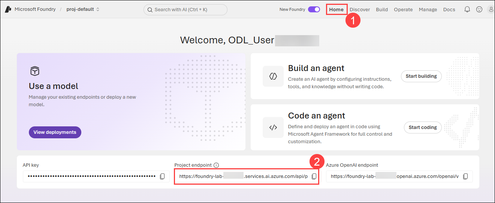

    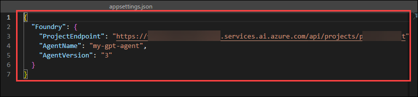

    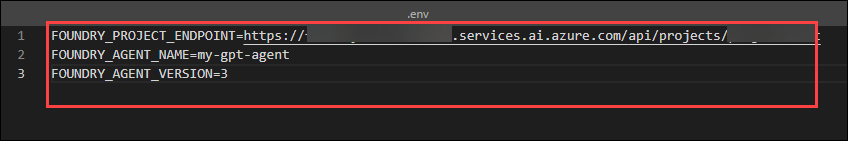

1. If you're using **C#**, navigate to `CSharp.csproj`, delete the existing code, then replace it with the following code, and then press **Ctrl+S** to save the file.

    ```xml
    <Project Sdk="Microsoft.NET.Sdk">

      <PropertyGroup>
        <OutputType>Exe</OutputType>
        <TargetFramework>net9.0</TargetFramework>
        <ImplicitUsings>enable</ImplicitUsings>
        <Nullable>enable</Nullable>
        <LangVersion>12</LangVersion>
      </PropertyGroup>

      <ItemGroup>
        <PackageReference Include="Azure.AI.Projects" Version="2.0.0" />
        <PackageReference Include="Azure.AI.Extensions.OpenAI" Version="2.0.0" />
        <PackageReference Include="Azure.Identity" Version="1.20.0" />
        <PackageReference Include="Microsoft.Extensions.Configuration" Version="8.0.0" />
        <PackageReference Include="Microsoft.Extensions.Configuration.Json" Version="8.0.0" />
      </ItemGroup>

      <ItemGroup>
        <None Update="appsettings.json">
          <CopyToOutputDirectory>PreserveNewest</CopyToOutputDirectory>
        </None>
      </ItemGroup>

    </Project>
    ```

    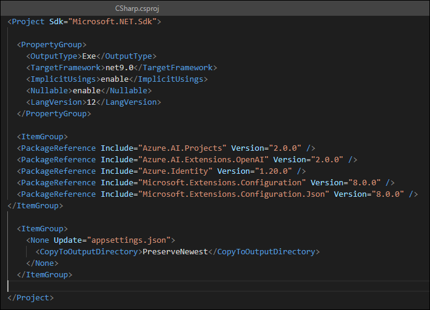

1. Navigate to the **CSharp** folder and install the necessary packages. These commands set up the environment for a local installation of the .NET SDK in Cloud Shell.

    For **C#:**

    ```bash
    cd CSharp
    ```

    ```bash
    export DOTNET_ROOT=$HOME/.dotnet
    mkdir -p $DOTNET_ROOT
    ```

    > **Note:** Azure Cloud Shell often does not have admin privileges, so you need to install .NET in your home directory. Here you are creating a separate `.dotnet` directory under your home directory to isolate your configuration.
    >
    > - `DOTNET_ROOT` specifies where your .NET runtime and SDK are located (in your `$HOME/.dotnet` directory).
    > - `mkdir -p $DOTNET_ROOT` creates the directory where the .NET runtime and SDK will be installed.

1. Run the following command to install the required SDK version locally:

    ```bash
    curl -fsSL https://dot.net/v1/dotnet-install.sh -o dotnet-install.sh
    chmod +x dotnet-install.sh
    ```

    ```bash
    ./dotnet-install.sh --channel 9.0 --install-dir $DOTNET_ROOT
    ```

    ```bash
    export PATH=$DOTNET_ROOT:$PATH
    ```

1. Enter the following command to restore any required workloads for your project, such as additional tools or libraries that are part of the .NET SDK.

    ```bash
    dotnet restore
    ```

1. If you prefer **Python**, navigate to the **Python** folder and install the necessary packages using the commands below:

    ```bash
    cd Python
    python -m venv labenv
    source labenv/bin/activate
    pip install python-dotenv openai==1.65.2
    ```

1. In the code editor, replace your entire file code.

    For **C#**: `OwnData.cs`

    ```csharp
    using Azure.AI.Projects;
    using Azure.AI.Extensions.OpenAI;
    using Azure.Identity;
    using Microsoft.Extensions.Configuration;
    using OpenAI.Responses;

    #pragma warning disable OPENAI001

    // Load configuration from appsettings.json
    IConfiguration config = new ConfigurationBuilder()
        .SetBasePath(AppContext.BaseDirectory)
        .AddJsonFile("appsettings.json", optional: false, reloadOnChange: false)
        .Build();

    // Read Microsoft Foundry configuration
    string projectEndpoint =
        config["Foundry:ProjectEndpoint"]
        ?? throw new InvalidOperationException(
            "Foundry:ProjectEndpoint is missing in appsettings.json");

    string agentName =
        config["Foundry:AgentName"]
        ?? throw new InvalidOperationException(
            "Foundry:AgentName is missing in appsettings.json");

    string agentVersion =
        config["Foundry:AgentVersion"]
        ?? throw new InvalidOperationException(
            "Foundry:AgentVersion is missing in appsettings.json");

    // Connect to Microsoft Foundry using your Azure identity
    AIProjectClient projectClient = new(
        endpoint: new Uri(projectEndpoint),
        tokenProvider: new DefaultAzureCredential()
    );

    // Reference the existing Foundry Agent
    AgentReference agentReference = new(
        name: agentName,
        version: agentVersion
    );

    // Create a Responses client configured for the agent
    ProjectResponsesClient responseClient =
        projectClient.ProjectOpenAIClient
            .GetProjectResponsesClientForAgent(agentReference);

    Console.WriteLine("Microsoft Foundry Agent connected.");
    Console.WriteLine($"Agent: {agentName}");
    Console.WriteLine($"Version: {agentVersion}");
    Console.WriteLine();
    Console.WriteLine("Enter your question.");
    Console.WriteLine("Type 'exit' to quit.");
    Console.WriteLine();

    while (true)
    {
        Console.Write("Question: ");

        string question = Console.ReadLine() ?? "";

        if (string.Equals(question, "exit", StringComparison.OrdinalIgnoreCase))
        {
            break;
        }

        if (string.IsNullOrWhiteSpace(question))
        {
            Console.WriteLine("Please enter a question.");
            Console.WriteLine();
            continue;
        }

        try
        {
            Console.WriteLine("\nSearching the agent's configured tools...");

            // Send the question to the existing Foundry Agent.
            // The agent's File Search/vector store configuration
            // is used by the agent automatically.
            ResponseResult response =
                responseClient.CreateResponse(question);

            Console.WriteLine("\nAgent response:");
            Console.WriteLine(response.GetOutputText());
            Console.WriteLine();
        }
        catch (Exception ex)
        {
            Console.WriteLine("\nError calling Microsoft Foundry Agent:");
            Console.WriteLine(ex.Message);
            Console.WriteLine();
        }
    }
    ```

    For **Python**: `ownData.py`

    ```python
    import os

    from dotenv import load_dotenv
    from azure.identity import DefaultAzureCredential
    from azure.ai.projects import AIProjectClient


    # Load values from .env
    load_dotenv()

    # Read Microsoft Foundry configuration
    endpoint = os.getenv("FOUNDRY_PROJECT_ENDPOINT")
    agent_name = os.getenv("FOUNDRY_AGENT_NAME")
    agent_version = os.getenv("FOUNDRY_AGENT_VERSION")


    # Validate configuration
    if not endpoint:
        raise ValueError("FOUNDRY_PROJECT_ENDPOINT is missing from .env")

    if not agent_name:
        raise ValueError("FOUNDRY_AGENT_NAME is missing from .env")

    if not agent_version:
        raise ValueError("FOUNDRY_AGENT_VERSION is missing from .env")


    # Connect to Microsoft Foundry
    project_client = AIProjectClient(
        endpoint=endpoint,
        credential=DefaultAzureCredential(),
    )


    # Get the OpenAI client for the Foundry project
    openai_client = project_client.get_openai_client()


    print("Microsoft Foundry Agent connected.")
    print(f"Agent: {agent_name}")
    print(f"Version: {agent_version}")
    print()
    print("Type 'exit' to quit.")
    print()


    # Continuously accept questions
    while True:

        question = input("Question: ")

        if question.lower() == "exit":
            break

        if not question.strip():
            print("Please enter a question.")
            continue

        try:
            # Send the question to the existing Foundry Agent
            response = openai_client.responses.create(
                input=[
                    {
                        "role": "user",
                        "content": question
                    }
                ],
                extra_body={
                    "agent_reference": {
                        "name": agent_name,
                        "version": agent_version,
                        "type": "agent_reference"
                    }
                },
            )

            print("\nAgent response:")
            print(response.output_text)
            print()

        except Exception as e:
            print("\nError calling Microsoft Foundry Agent:")
            print(e)
            print()
    ```

1. Save the changes to the code file.

## Task 6: Run your application

In this task, you will run your configured app to send a request to your model and observe the response, noting that the only difference between options is the prompt content while all other parameters (such as token count and temperature) remain consistent.

1. In the **Cloud Shell** bash terminal, navigate to the folder for your preferred language.

1. In the interactive terminal pane, ensure the folder context is the folder for your preferred language. Then enter the following command to run the application.

    - **C#**: `dotnet run`
    - **Python**: `python ownData.py`

    > **Note:** If you encounter any errors after running the Python script, try upgrading the OpenAI package by running the following command:

    ```bash
    pip install --user --upgrade openai
    ```

1. Review the response to the prompt `Tell me about London`, which should include an answer as well as some details of the data used to ground the prompt, which was obtained from your search service.

    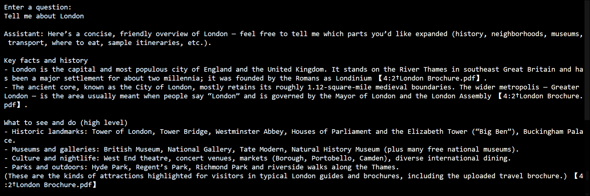

## 🧾 Summary

In this lab, you began by evaluating how a Microsoft Foundry Model responds without grounding data to understand its baseline behavior. You then created an Agent with file search capabilities and connected it to a vector store containing your custom data, enabling grounded responses. By comparing outputs before and after grounding, you observed how Retrieval-Augmented Generation (RAG) improves the relevance and accuracy of responses. You also set up a development environment in Azure Cloud Shell, explored the provided application code, and configured it with your Microsoft Foundry credentials and Agent details. Finally, you executed the application to interact programmatically with a grounded AI model, completing an end-to-end implementation of a RAG-based solution.

### You have successfully completed the lab. Click on **Next >>** to proceed with the next lab.


