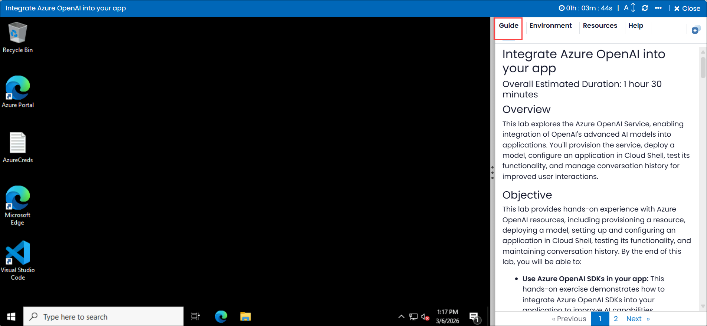
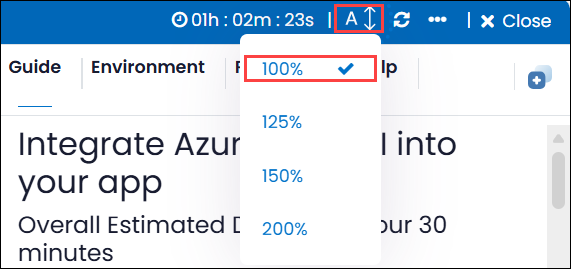
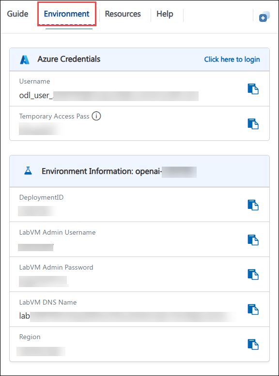
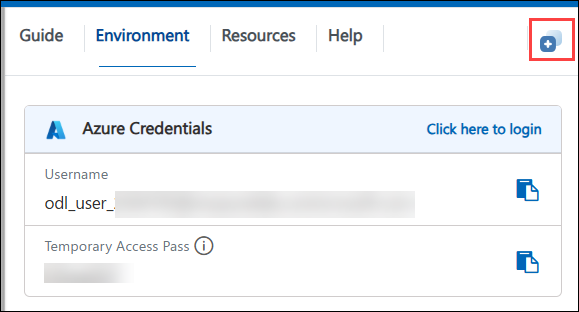
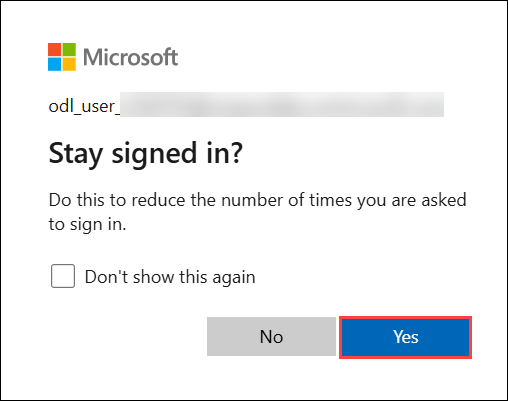

# Integrate Azure OpenAI into your app

### Overall Estimated Duration: 1 hour 30 minutes

## Overview

This lab explores the Azure OpenAI Service, enabling integration of OpenAI's advanced AI models into applications. You'll provision the service, deploy a model, configure an application in Cloud Shell, test its functionality, and manage conversation history for improved user interactions.

## Objective

This lab provides hands-on experience with Azure OpenAI resources, including provisioning a resource, deploying a model, setting up and configuring an application in Cloud Shell, testing its functionality, and maintaining conversation history. By the end of this lab, you will be able to:

- **Use Azure OpenAI SDKs in your app:** This hands-on exercise demonstrates how to integrate Azure OpenAI SDKs into your application to improve AI capabilities. Participants will integrate and use Azure OpenAI SDKs within their application.

## Pre-requisites

- **Development Skills:** Basic programming knowledge and experience with APIs and SDKs.

- **AI Concepts:** Understanding prompt engineering, code development, and image generation using models such as DALL-E.

- **Content Management:** Understanding data integration for RAG and content filtering techniques.

## Architecture

The architecture leverages Azure OpenAI Service to provision a resource, deploy models, and set up an application in Cloud Shell. The workflow involves configuring, testing, and maintaining the application, enabling efficient AI-driven solutions with Azure’s scalability and secure infrastructure.

## Architecture Diagram

 

## Explanation of Components

The architecture for this lab involves the following key components:

- **Azure OpenAI Resource:** Provision an Azure OpenAI resource to access OpenAI’s advanced AI models and integrate them into custom applications.

- **Model Deployment:** Deploy an OpenAI model to enable functionality for testing and application use cases.

- **Application Setup:** Set up an application in Cloud Shell to interact with the deployed model and test its capabilities.

- **Application Configuration:** Configure the application to meet specific requirements, ensuring seamless integration with Azure OpenAI services.

- **Application Testing:** Test the application to validate its performance, ensuring it interacts effectively with the deployed model.

## Getting Started with Lab

Welcome to your Get Started with Azure OpenAI Service Workshop! We've prepared a seamless environment for you to explore and learn about Azure services. Let's begin by making the most of this experience.

## Accessing Your Lab Environment

Once you're ready to dive in, your virtual machine and the **Guide** will be right at your fingertips within your web browser.

   

## Virtual Machine & Lab Guide
 
Your virtual machine is your workhorse throughout the workshop. The lab guide is your roadmap to success.

## Lab Guide Zoom In/Zoom Out

To adjust the zoom level for the environment page, click the **A↕ : 100%** icon located next to the timer in the lab environment.

   

## Exploring Your Lab Resources
 
To get a better understanding of your lab resources and credentials, navigate to the **Environment** tab.

   

## Utilizing the Split Window Feature
 
For your convenience, you can open the lab guide in a separate window by selecting the **Split Window** button from the top right corner.

  
## Managing Your Virtual Machine
 
Feel free to **Start, Restart, or Stop (2)** your virtual machine as needed from the **Resources (1)** tab. Your experience is in your hands!
 

## Let's Get Started with Azure Portal
 
1. On your virtual machine, click on the **Azure Portal** icon as shown below:
 
      .png)
    
2. You'll see the **Sign in to continue to Microsoft Azure** tab. Here, enter your credentials:
 
   - **Email/Username:** <inject key="AzureAdUserEmail"></inject>
 
       
 
3. Next, provide your password:
 
   - **Password:** <inject key="AzureAdUserPassword"></inject>
 
       
 
4. In the **Stay signed in?** pop-up, click **Yes**.

   
 
## Support Contact

The CloudLabs support team is available 24/7, 365 days a year, via email and live chat to ensure seamless assistance at any time. We offer dedicated support channels tailored specifically for both learners and instructors, ensuring that all your needs are promptly and efficiently addressed.

Learner Support Contacts:

- Email Support: cloudlabs-support@spektrasystems.com

- Live Chat Support: https://cloudlabs.ai/labs-support

Now, click on **Next** from the lower right corner to move on to the next page.

## Happy Learning!!
